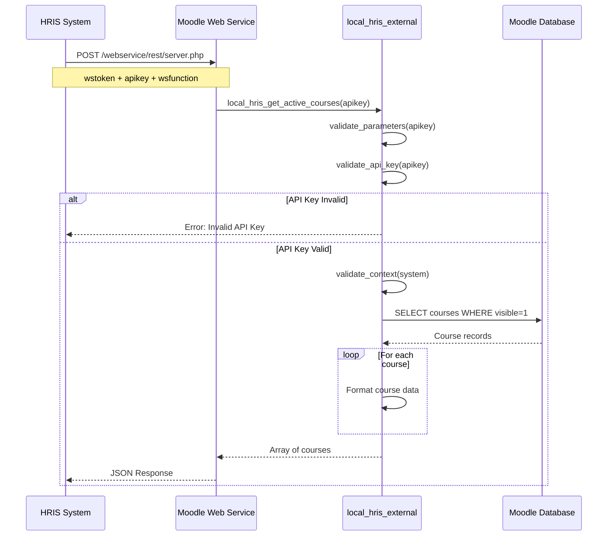
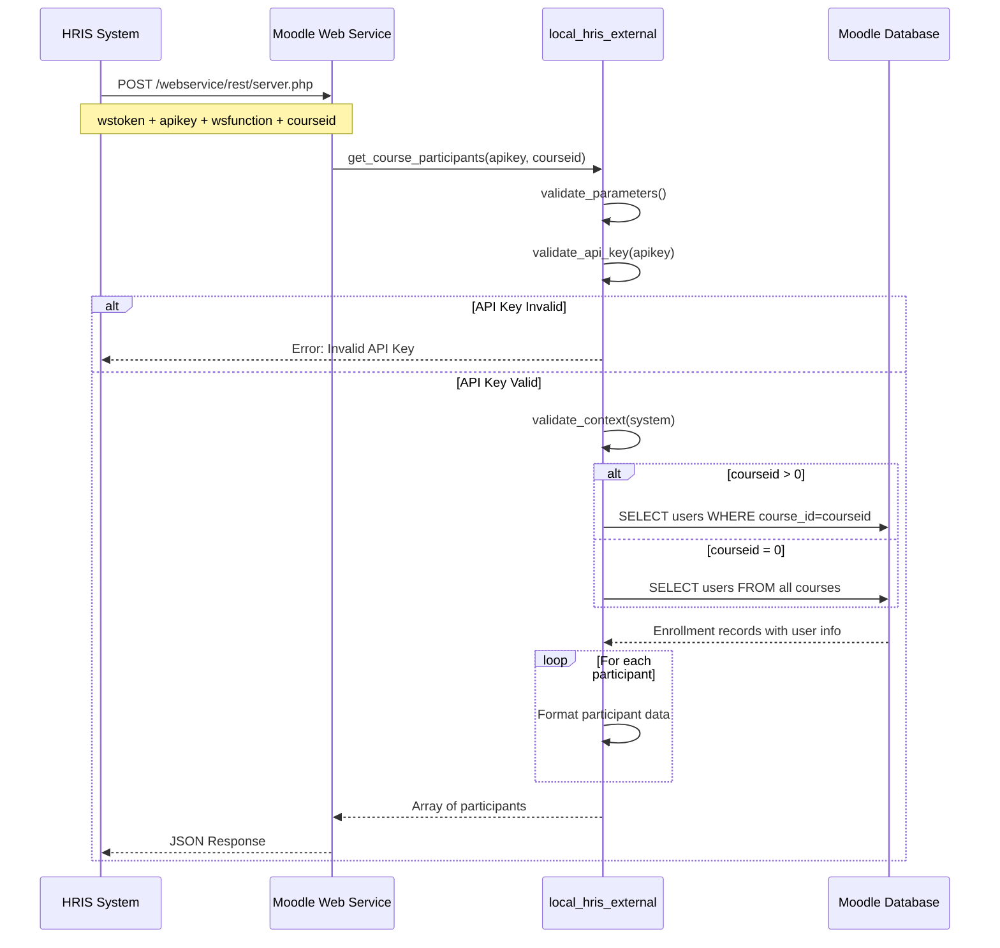
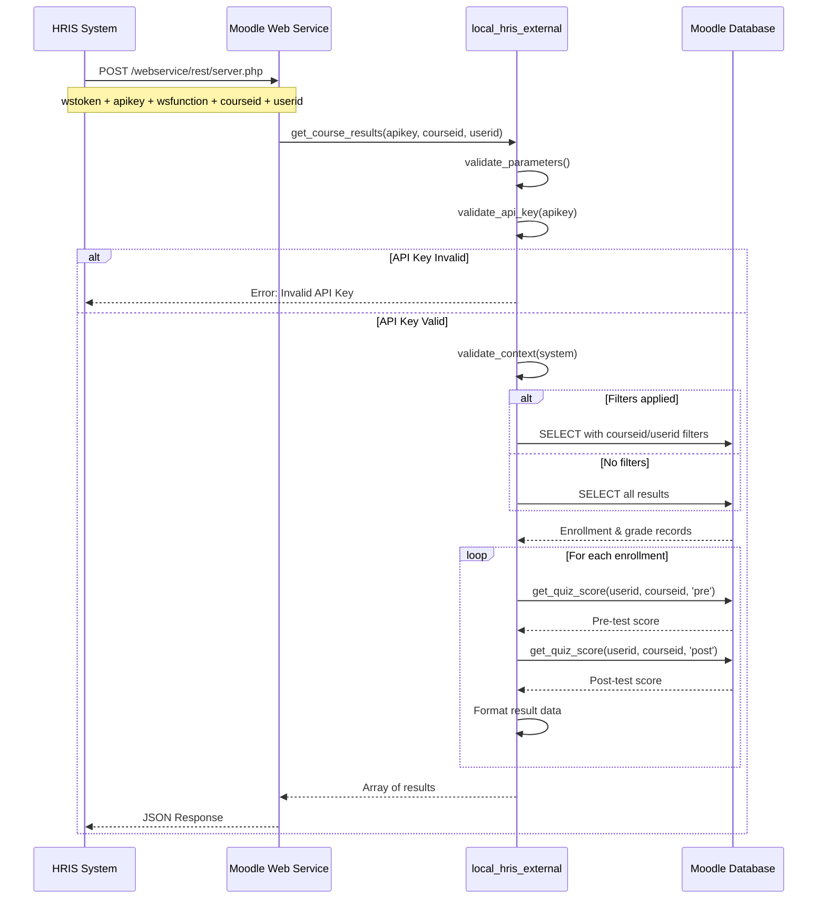
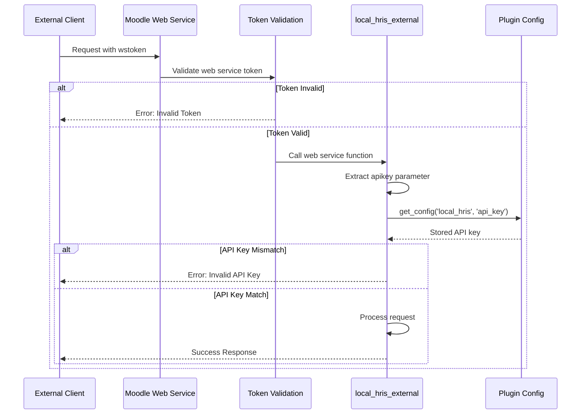

# API Guide – HRIS Integration Plugin (local_hris)

Dokumentasi teknis lengkap REST API untuk integrasi sistem HRIS dengan Moodle.

---

## 📐 Arsitektur & Desain

### System Architecture

```
┌─────────────────────┐
│   HRIS System       │
│  (External Client)  │
└──────────┬──────────┘
           │ HTTPS/REST
           ▼
┌─────────────────────┐
│   Moodle Web        │
│   Service Layer     │
│  (REST Protocol)    │
└──────────┬──────────┘
           │
           ▼
┌─────────────────────┐
│   local_hris        │
│   External API      │
│  (Authentication    │
│   & Validation)     │
└──────────┬──────────┘
           │
           ▼
┌─────────────────────┐
│   Moodle Database   │
│  (courses, users,   │
│   grades, etc)      │
└─────────────────────┘
```

### Component Diagram

```
┌────────────────────────────────────────────────────┐
│            local_hris Plugin                       │
│                                                    │
│  ┌──────────────────────────────────────────┐    │
│  │  external.php (External API Class)       │    │
│  │                                           │    │
│  │  • validate_api_key()                    │    │
│  │  • get_active_courses()                  │    │
│  │  • get_course_participants()             │    │
│  │  • get_course_results()                  │    │
│  │  • get_all_course_results()              │    │
│  │  • get_quiz_score() [private]            │    │
│  │  • get_questionnaire_scores() [private]  │    │
│  └───────────────┬──────────────────────────┘    │
│                  │                                │
│  ┌───────────────▼──────────────────────────┐    │
│  │  services.php (Service Definitions)      │    │
│  │                                           │    │
│  │  • Function mappings                     │    │
│  │  • Service configuration                 │    │
│  │  • Capabilities & permissions            │    │
│  └──────────────────────────────────────────┘    │
│                                                    │
│  ┌──────────────────────────────────────────┐    │
│  │  settings.php (Admin Configuration)      │    │
│  │                                           │    │
│  │  • Enable/Disable API                    │    │
│  │  • API Key management                    │    │
│  └──────────────────────────────────────────┘    │
└────────────────────────────────────────────────────┘
```

---

## 🔄 Sequence Diagrams

### 1. Get Active Courses Flow



### 2. Get Course Participants Flow



### 3. Get Course Results Flow



### 4. Authentication Flow



---

## 🗺️ Data Flow Architecture

```
┌─────────────────────────────────────────────────┐
│              Request Flow                        │
└─────────────────────────────────────────────────┘

1. HRIS System → Moodle Web Service Endpoint
   ├── Method: POST
   ├── Content-Type: application/x-www-form-urlencoded
   ├── Parameters: wstoken, wsfunction, apikey, [other params]
   └── Format: JSON/XML

2. Moodle Web Service Layer
   ├── Validate web service token
   ├── Check service enabled
   ├── Verify function exists
   └── Route to external function

3. local_hris External API
   ├── Validate API key (custom security)
   ├── Validate parameters (type checking)
   ├── Validate context (system context)
   └── Execute business logic

4. Database Queries
   ├── Execute SQL queries
   ├── Join necessary tables
   ├── Apply filters (courseid, userid)
   └── Return raw data

5. Data Processing
   ├── Format data according to structure
   ├── Calculate scores (pre/post test)
   ├── Apply data transformations
   └── Build response array

6. Response Flow
   └── JSON/XML Response → HRIS System
```

---

## 🔒 Security Model

```
┌─────────────────────────────────────────────────┐
│         Security Layers                          │
└─────────────────────────────────────────────────┘

Layer 1: Transport Security
├── HTTPS encryption (SSL/TLS)
└── Secure communication channel

Layer 2: Moodle Web Service Token
├── Token-based authentication
├── Token associated with user account
├── Token permissions and capabilities
└── Token expiration (if configured)

Layer 3: Plugin API Key
├── Custom API key validation
├── Stored in Moodle config
├── Validated on every request
└── Additional security layer

Layer 4: Context & Capability Validation
├── System context validation
├── User permissions check
└── Data visibility rules

Layer 5: Parameter Validation
├── Type checking (PARAM_INT, PARAM_TEXT, etc)
├── Required parameter enforcement
└── SQL injection prevention
```

---

## 🚀 API Endpoints

### Ringkasan Fungsi

| Fungsi | Tipe | Parameter | Deskripsi |
|--------|------|-----------|-----------|
| `local_hris_get_active_courses` | Read | apikey | Daftar kursus yang aktif/visible |
| `local_hris_get_course_participants` | Read | apikey, courseid | Daftar peserta yang terdaftar |
| `local_hris_get_course_results` | Read | apikey, courseid, userid | Hasil belajar beserta skor |
| `local_hris_get_all_course_results` | Read | apikey, courseid | Hasil belajar + skor kuesioner |

---

### 1. Get Active Courses

**Function**: `local_hris_get_active_courses`

Mengembalikan daftar semua kursus yang visible/aktif di sistem.

**Response Fields**:

| Field | Tipe | Deskripsi |
|-------|------|-----------|
| `id` | int | Course ID |
| `shortname` | string | Nama pendek kursus |
| `fullname` | string | Nama lengkap kursus |
| `summary` | string | Deskripsi kursus (tanpa HTML) |
| `startdate` | int | Timestamp mulai kursus |
| `enddate` | int | Timestamp akhir kursus |
| `visible` | int | Flag visibilitas kursus |
| `category_id` | int | ID kategori kursus |
| `category_name` | string | Nama kategori kursus |

---

### 2. Get Course Participants

**Function**: `local_hris_get_course_participants`

Mengembalikan daftar peserta yang terdaftar di kursus.

**Parameters**:

| Parameter | Tipe | Wajib | Default | Deskripsi |
|-----------|------|-------|---------|-----------|
| `courseid` | int | Tidak | 0 | Course ID tertentu (0 = semua kursus) |

**Response Fields**:

| Field | Tipe | Deskripsi |
|-------|------|-----------|
| `user_id` | int | User ID |
| `email` | string | Alamat email pengguna |
| `firstname` | string | Nama depan |
| `lastname` | string | Nama belakang |
| `company_name` | string | Nama cabang/organisasi (dari profil field `branch`) |
| `course_id` | int | Course ID |
| `course_shortname` | string | Nama pendek kursus |
| `course_name` | string | Nama lengkap kursus |
| `role_name` | string | Peran pengguna di kursus (misal: `student`, `teacher`, `editingteacher`) |
| `enrollment_date` | int | Timestamp pendaftaran |

---

### 3. Get Course Results

**Function**: `local_hris_get_course_results`

Hasil belajar lengkap dengan skor pre-test dan post-test.

**Parameters**:

| Parameter | Tipe | Wajib | Default | Deskripsi |
|-----------|------|-------|---------|-----------|
| `courseid` | int | Tidak | 0 | Course ID tertentu (0 = semua kursus) |
| `userid` | int | Tidak | 0 | User ID tertentu (0 = semua pengguna) |

**Response Fields**:

| Field | Tipe | Deskripsi |
|-------|------|-----------|
| `user_id` | int | User ID |
| `email` | string | Alamat email pengguna |
| `firstname` | string | Nama depan |
| `lastname` | string | Nama belakang |
| `company_name` | string | Nama cabang/organisasi (dari custom field `branch`) |
| `course_id` | int | Course ID |
| `course_shortname` | string | Nama pendek kursus |
| `course_name` | string | Nama lengkap kursus |
| `role_name` | string | Peran pengguna di kursus (misal: `student`, `teacher`, `editingteacher`) |
| `final_grade` | float | Nilai akhir kursus |
| `pretest_score` | float | Skor pre-test (custom field `jenis_quiz` = 2) |
| `posttest_score` | float | Skor post-test (custom field `jenis_quiz` = 3) |
| `completion_date` | int | Timestamp penyelesaian kursus (0 jika belum selesai) |
| `is_completed` | int | Status penyelesaian (1 = selesai, 0 = belum) |

---

### 4. Get All Course Results (dengan Skor Kuesioner)

**Function**: `local_hris_get_all_course_results`

Hasil belajar agregat termasuk skor kuesioner per pengguna dan kursus.

**Parameters**:

| Parameter | Tipe | Wajib | Default | Deskripsi |
|-----------|------|-------|---------|-----------|
| `courseid` | int | Tidak | 0 | Course ID tertentu (0 = semua kursus) |

**Response Fields**:

| Field | Tipe | Deskripsi |
|-------|------|-----------|
| `course_id` | int | Course ID |
| `course_name` | string | Nama lengkap kursus |
| `course_shortname` | string | Nama pendek kursus |
| `user_id` | int | User ID |
| `firstname` | string | Nama depan |
| `lastname` | string | Nama belakang |
| `email` | string | Alamat email pengguna |
| `company_name` | string | Nama cabang/organisasi (dari custom field `branch`) |
| `role_name` | string | Peran pengguna di kursus (misal: `student`, `teacher`, `editingteacher`) |
| `final_grade` | float | Nilai akhir kursus |
| `pretest_score` | float | Skor pre-test (custom field `jenis_quiz` = 2) |
| `posttest_score` | float | Skor post-test (custom field `jenis_quiz` = 3) |
| `completion_date` | int | Timestamp penyelesaian kursus (0 jika belum selesai) |
| `is_completed` | int | Status penyelesaian (1 = selesai, 0 = belum) |
| `questionnaire_available` | int | 1 jika skor kuesioner tersedia, 0 jika tidak |
| `score_materi` | float | Rata-rata skor pertanyaan 1–3 (Materi) |
| `score_trainer` | float | Rata-rata skor pertanyaan 4–6 (Trainer) |
| `score_fasilitas` | float | Rata-rata skor pertanyaan 7–9 (Fasilitas/Venue) |
| `score_total` | float | Rata-rata skor keseluruhan |

---

## 🗃️ Database Schema Reference

### Tabel-Tabel yang Digunakan

```sql
-- Courses
{course}
├── id (Course ID)
├── shortname
├── fullname
├── summary
├── startdate
├── enddate
└── visible

-- User Enrollments
{user_enrolments}
├── userid
├── enrolid
└── timecreated

-- Enrolment Methods
{enrol}
├── id
├── courseid
└── status

-- Users
{user}
├── id
├── email
├── firstname
├── lastname
├── deleted
└── confirmed

-- User Custom Fields
{user_info_field}
├── id
├── shortname (e.g., 'branch')
└── name

{user_info_data}
├── userid
├── fieldid
└── data (field value)

-- Course Modules
{course_modules}
├── id
├── course
├── module
└── instance

{modules}
├── id
└── name

-- Course Module Custom Fields
{customfield_data}
├── instanceid (course_modules.id)
├── fieldid
└── value (1=Normal, 2=PreTest, 3=PostTest)

-- Course Completion
{course_completions}
├── userid
├── course
└── timecompleted

-- Grades
{grade_items}
├── id
├── courseid
└── itemtype

{grade_grades}
├── userid
├── itemid
└── finalgrade

-- Questionnaire
{questionnaire}
├── id
└── name

{questionnaire_question}
├── id
├── surveyid
└── type_id

{questionnaire_quest_choice}
├── id
└── question_id

{questionnaire_response}
├── id
├── questionnaireid
└── userid

{questionnaire_response_rank}
├── id
├── response_id
├── question_id
├── choice_id
└── rankvalue
```

---

## 🔍 Query Logic Explanation

### Pre/Post Test Detection

Plugin mendeteksi quiz pre-test dan post-test menggunakan nilai custom field pada course modules:

**Konfigurasi Custom Field**:
- Nama field: `jenis_quiz`
- Diterapkan pada: Course modules (quiz instances)
- Nilai:
  - `2` = PreTest
  - `3` = PostTest
  - `1` = Normal

**Langkah Setup**:
1. Buat custom field pada course modules dengan shortname `jenis_quiz`
2. Untuk setiap quiz, set nilai custom field (2 untuk pre-test, 3 untuk post-test)
3. Skor diambil dari tabel `grade_grades` menggunakan custom field sebagai filter

**Metode Deteksi**:
```sql
-- Pre-test: Custom field value = 2
JOIN {customfield_data} cfd ON cfd.instanceid = cm.id AND cfd.value = '2'

-- Post-test: Custom field value = 3
JOIN {customfield_data} cfd ON cfd.instanceid = cm.id AND cfd.value = '3'
```

### Questionnaire Score Calculation

Skor kuesioner hanya tersedia di `local_hris_get_all_course_results`.

**Ringkasan Logika**:
- Mencari modul questionnaire yang visible di kursus.
- Menemukan Rate question pertama (`type_id = 8`).
- Jika respons tersedia:
  - Saat Rate question memiliki **tepat 9 pilihan**:
    - `score_materi` = rata-rata pilihan 1–3
    - `score_trainer` = rata-rata pilihan 4–6
    - `score_fasilitas` = rata-rata pilihan 7–9
    - `score_total` = rata-rata semua 9 pilihan
    - `questionnaire_available` = 1
  - Saat Rate question memiliki jumlah pilihan **berbeda dari 9**:
    - `score_total` = rata-rata semua pilihan
    - `questionnaire_available` = 1 jika `score_total` > 0, selainnya 0
    - `score_materi`, `score_trainer`, `score_fasilitas` = 0
- Jika tidak ada questionnaire, Rate question, atau respons: semua skor = 0 dan `questionnaire_available` = 0

---

## 🔧 API Usage

### Konfigurasi Endpoint

**Base URL**: `https://yourmoodle.com/webservice/rest/server.php`

**HTTP Method**: `POST`

**Content-Type**: `application/x-www-form-urlencoded`

### Required Parameters (Semua Fungsi)

| Parameter | Tipe | Deskripsi |
|-----------|------|-----------|
| `wstoken` | string | Web service token (dari Moodle) |
| `wsfunction` | string | Nama fungsi yang dipanggil |
| `moodlewsrestformat` | string | Format respons (`json` atau `xml`) |
| `apikey` | string | API key plugin (dari pengaturan) |

### Authentication

Semua API call memerlukan:
- `wstoken`: Web service token
- `apikey`: HRIS API key (dikonfigurasi di pengaturan plugin)

---

### Contoh Request (cURL)

#### Contoh 1: Get Active Courses
```bash
curl -X POST "https://yourmoodle.com/webservice/rest/server.php" \
  -H "Content-Type: application/x-www-form-urlencoded" \
  -d "wstoken=YOUR_WS_TOKEN" \
  -d "wsfunction=local_hris_get_active_courses" \
  -d "moodlewsrestformat=json" \
  -d "apikey=YOUR_API_KEY"
```

#### Contoh 2: Get Participants untuk Kursus Tertentu
```bash
curl -X POST "https://yourmoodle.com/webservice/rest/server.php" \
  -H "Content-Type: application/x-www-form-urlencoded" \
  -d "wstoken=YOUR_WS_TOKEN" \
  -d "wsfunction=local_hris_get_course_participants" \
  -d "moodlewsrestformat=json" \
  -d "apikey=YOUR_API_KEY" \
  -d "courseid=5"
```

#### Contoh 3: Get Results untuk Semua Pengguna di Semua Kursus
```bash
curl -X POST "https://yourmoodle.com/webservice/rest/server.php" \
  -H "Content-Type: application/x-www-form-urlencoded" \
  -d "wstoken=YOUR_WS_TOKEN" \
  -d "wsfunction=local_hris_get_course_results" \
  -d "moodlewsrestformat=json" \
  -d "apikey=YOUR_API_KEY" \
  -d "courseid=0" \
  -d "userid=0"
```

#### Contoh 4: Get Results untuk Pengguna Tertentu di Kursus Tertentu
```bash
curl -X POST "https://yourmoodle.com/webservice/rest/server.php" \
  -H "Content-Type: application/x-www-form-urlencoded" \
  -d "wstoken=YOUR_WS_TOKEN" \
  -d "wsfunction=local_hris_get_course_results" \
  -d "moodlewsrestformat=json" \
  -d "apikey=YOUR_API_KEY" \
  -d "courseid=5" \
  -d "userid=123"
```

#### Contoh 5: Get All Course Results (dengan Skor Kuesioner)
```bash
curl -X POST "https://yourmoodle.com/webservice/rest/server.php" \
  -H "Content-Type: application/x-www-form-urlencoded" \
  -d "wstoken=YOUR_WS_TOKEN" \
  -d "wsfunction=local_hris_get_all_course_results" \
  -d "moodlewsrestformat=json" \
  -d "apikey=YOUR_API_KEY" \
  -d "courseid=0"
```

---

### Contoh Response

#### Success Response – Get Active Courses
```json
[
  {
    "id": 2,
    "shortname": "course101",
    "fullname": "Introduction to Programming",
    "summary": "Learn basic programming concepts",
    "startdate": 1703980800,
    "enddate": 1706659200,
    "visible": 1,
    "category_id": 3,
    "category_name": "IT Training"
  },
  {
    "id": 3,
    "shortname": "webdev101",
    "fullname": "Web Development Fundamentals",
    "summary": "Master HTML, CSS, and JavaScript",
    "startdate": 1704067200,
    "enddate": 1706745600,
    "visible": 1,
    "category_id": 3,
    "category_name": "IT Training"
  }
]
```

#### Success Response – Get Course Participants
```json
[
  {
    "user_id": 45,
    "email": "john.doe@company.com",
    "firstname": "John",
    "lastname": "Doe",
    "company_name": "Tech Corp",
    "course_id": 5,
    "course_shortname": "course101",
    "course_name": "Introduction to Programming",
    "role_name": "student",
    "enrollment_date": 1704153600
  }
]
```

#### Success Response – Get Course Results
```json
[
  {
    "user_id": 45,
    "email": "john.doe@company.com",
    "firstname": "John",
    "lastname": "Doe",
    "company_name": "Tech Corp",
    "course_id": 5,
    "course_shortname": "course101",
    "course_name": "Introduction to Programming",
    "role_name": "student",
    "final_grade": 85.5,
    "pretest_score": 65.0,
    "posttest_score": 90.0,
    "completion_date": 1706659200,
    "is_completed": 1
  }
]
```

#### Success Response – Get All Course Results
```json
[
  {
    "course_id": 5,
    "course_name": "Introduction to Programming",
    "course_shortname": "course101",
    "user_id": 45,
    "firstname": "John",
    "lastname": "Doe",
    "email": "john.doe@company.com",
    "company_name": "Tech Corp",
    "role_name": "student",
    "final_grade": 85.5,
    "pretest_score": 65.0,
    "posttest_score": 90.0,
    "completion_date": 1706659200,
    "is_completed": 1,
    "questionnaire_available": 1,
    "score_materi": 4.33,
    "score_trainer": 4.67,
    "score_fasilitas": 4.00,
    "score_total": 4.33
  }
]
```

#### Error Response – Invalid API Key
```json
{
  "exception": "moodle_exception",
  "errorcode": "invalidapikey",
  "message": "Invalid API key"
}
```

#### Error Response – Invalid Web Service Token
```json
{
  "exception": "webservice_access_exception",
  "errorcode": "accessexception",
  "message": "Access control exception"
}
```

---

## 🧩 Contoh Integrasi CodeIgniter 3 (CI3)

### 1. Konfigurasi

Tambahkan konfigurasi di `application/config/hris.php`:

```php
<?php
defined('BASEPATH') OR exit('No direct script access allowed');

$config['hris_base_url'] = 'https://yourmoodle.com/webservice/rest/server.php';
$config['hris_ws_token'] = 'YOUR_WS_TOKEN';
$config['hris_api_key'] = 'YOUR_API_KEY';
$config['hris_format'] = 'json';
```

### 2. Library Client

Buat `application/libraries/Hris_client.php`:

```php
<?php
defined('BASEPATH') OR exit('No direct script access allowed');

class Hris_client {

  protected $CI;
  protected $base_url;
  protected $token;
  protected $api_key;
  protected $format;

  public function __construct() {
    $this->CI =& get_instance();
    $this->CI->load->config('hris');
    $this->CI->load->library('curl');

    $this->base_url = $this->CI->config->item('hris_base_url');
    $this->token = $this->CI->config->item('hris_ws_token');
    $this->api_key = $this->CI->config->item('hris_api_key');
    $this->format = $this->CI->config->item('hris_format');
  }

  protected function call_api($function, $params = []) {
    $payload = array_merge([
      'wstoken' => $this->token,
      'wsfunction' => $function,
      'moodlewsrestformat' => $this->format,
      'apikey' => $this->api_key,
    ], $params);

    $response = $this->CI->curl->simple_post($this->base_url, $payload);
    return json_decode($response, true);
  }

  public function get_active_courses() {
    return $this->call_api('local_hris_get_active_courses');
  }

  public function get_course_participants($courseid = 0) {
    return $this->call_api('local_hris_get_course_participants', [
      'courseid' => (int)$courseid
    ]);
  }

  public function get_course_results($courseid = 0, $userid = 0) {
    return $this->call_api('local_hris_get_course_results', [
      'courseid' => (int)$courseid,
      'userid' => (int)$userid
    ]);
  }

  public function get_all_course_results($courseid = 0) {
    return $this->call_api('local_hris_get_all_course_results', [
      'courseid' => (int)$courseid
    ]);
  }
}
```

### 3. Controller Contoh

Buat `application/controllers/Hris_demo.php`:

```php
<?php
defined('BASEPATH') OR exit('No direct script access allowed');

class Hris_demo extends CI_Controller {

  public function __construct() {
    parent::__construct();
    $this->load->library('Hris_client');
  }

  public function courses() {
    $data = $this->hris_client->get_active_courses();
    $this->output
      ->set_content_type('application/json')
      ->set_output(json_encode($data));
  }

  public function participants($courseid = 0) {
    $data = $this->hris_client->get_course_participants($courseid);
    $this->output
      ->set_content_type('application/json')
      ->set_output(json_encode($data));
  }

  public function results($courseid = 0, $userid = 0) {
    $data = $this->hris_client->get_course_results($courseid, $userid);
    $this->output
      ->set_content_type('application/json')
      ->set_output(json_encode($data));
  }

  public function all_results($courseid = 0) {
    $data = $this->hris_client->get_all_course_results($courseid);
    $this->output
      ->set_content_type('application/json')
      ->set_output(json_encode($data));
  }
}
```

### 4. Contoh Akses Endpoint CI3

```
GET /index.php/hris_demo/courses
GET /index.php/hris_demo/participants/5
GET /index.php/hris_demo/results/5/123
GET /index.php/hris_demo/all_results/0
```

> **Catatan**: Contoh di atas menggunakan library `curl` bawaan CI3. Jika belum tersedia, aktifkan atau tambahkan library cURL sesuai standar CI3.

---

## 🧪 Testing

### Built-in Testing Interface

Akses halaman testing bawaan:
```
https://yourmoodle.com/local/hris/test_api.php
```

Halaman ini menyediakan:
- ✅ Pemeriksaan status konfigurasi
- 🔧 Verifikasi setup web service
- 📝 Contoh API call untuk setiap fungsi
- 📋 Petunjuk setup
- 📖 Daftar fungsi yang tersedia
- 🔑 Informasi token dan API key

### Manual Testing dengan cURL

#### Test 1: Verifikasi Konektivitas API
```bash
curl -X POST "https://yourmoodle.com/webservice/rest/server.php" \
  -d "wstoken=YOUR_TOKEN" \
  -d "wsfunction=local_hris_get_active_courses" \
  -d "moodlewsrestformat=json" \
  -d "apikey=YOUR_API_KEY"
```
Expected: JSON array kursus atau pesan error

#### Test 2: Validasi API Key
```bash
# Test dengan API key yang salah
curl -X POST "https://yourmoodle.com/webservice/rest/server.php" \
  -d "wstoken=YOUR_TOKEN" \
  -d "wsfunction=local_hris_get_active_courses" \
  -d "moodlewsrestformat=json" \
  -d "apikey=WRONG_KEY"
```
Expected: Error message "Invalid API key"

#### Test 3: Verifikasi Filter Data
```bash
curl -X POST "https://yourmoodle.com/webservice/rest/server.php" \
  -d "wstoken=YOUR_TOKEN" \
  -d "wsfunction=local_hris_get_course_participants" \
  -d "moodlewsrestformat=json" \
  -d "apikey=YOUR_API_KEY" \
  -d "courseid=5"
```
Expected: Hanya peserta dari course ID 5

### Testing Checklist

- [ ] Web services diaktifkan di Moodle
- [ ] REST protocol diaktifkan
- [ ] HRIS service dibuat dan diaktifkan
- [ ] Web service token dibuat
- [ ] API key dikonfigurasi di pengaturan plugin
- [ ] Test user memiliki izin yang sesuai
- [ ] HTTPS dikonfigurasi (direkomendasikan untuk produksi)
- [ ] Dapat mengambil active courses
- [ ] Dapat mengambil course participants
- [ ] Dapat mengambil course results dengan skor
- [ ] Dapat mengambil all course results dengan skor kuesioner
- [ ] Validasi API key berfungsi
- [ ] Error handling mengembalikan pesan yang tepat
- [ ] Deteksi pre/post test bekerja dengan benar
- [ ] Skor kuesioner dihitung dengan benar (jika tersedia)

---

*Dokumentasi ini adalah bagian dari plugin [local_hris](README.md).*
