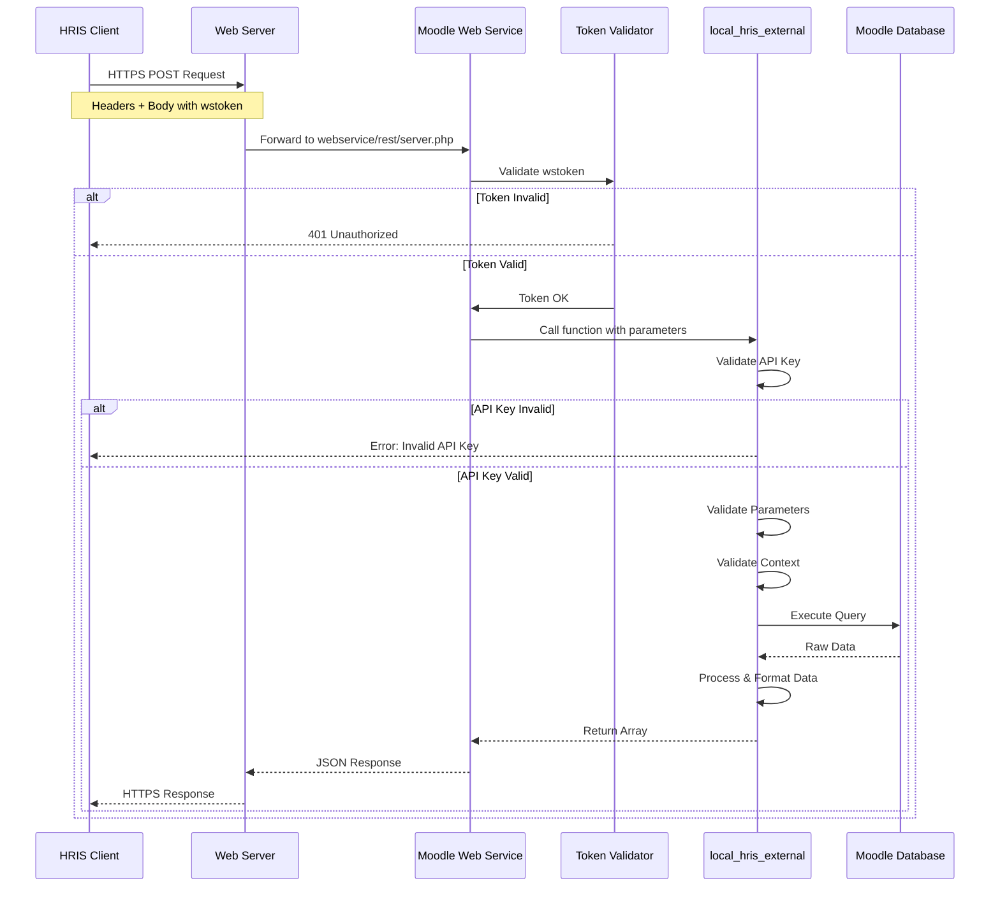
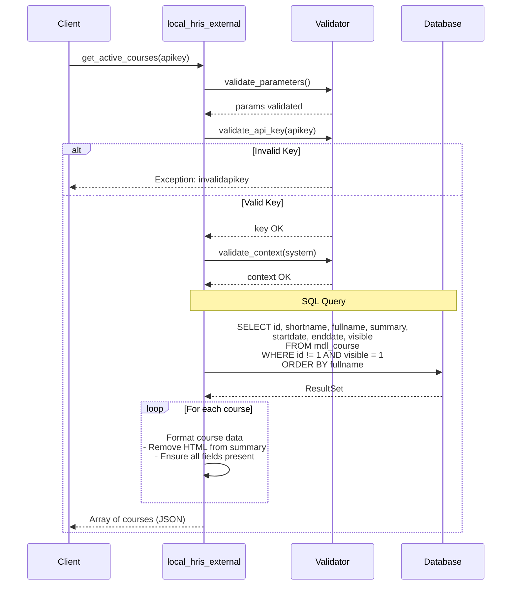
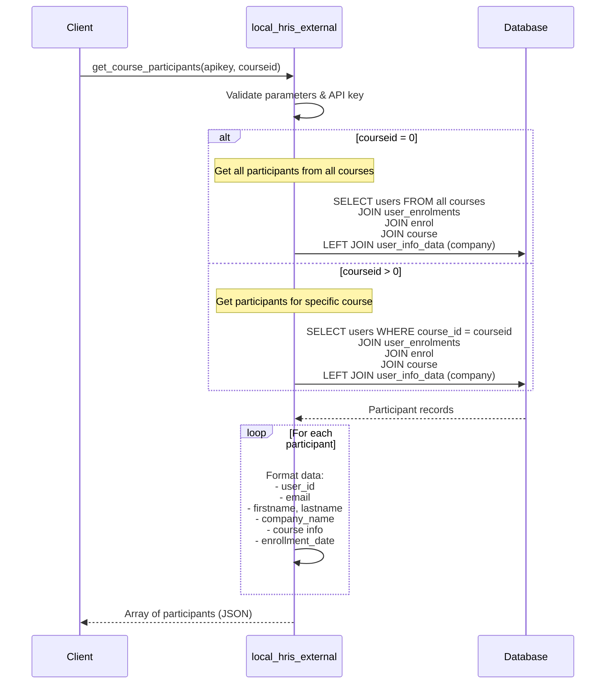
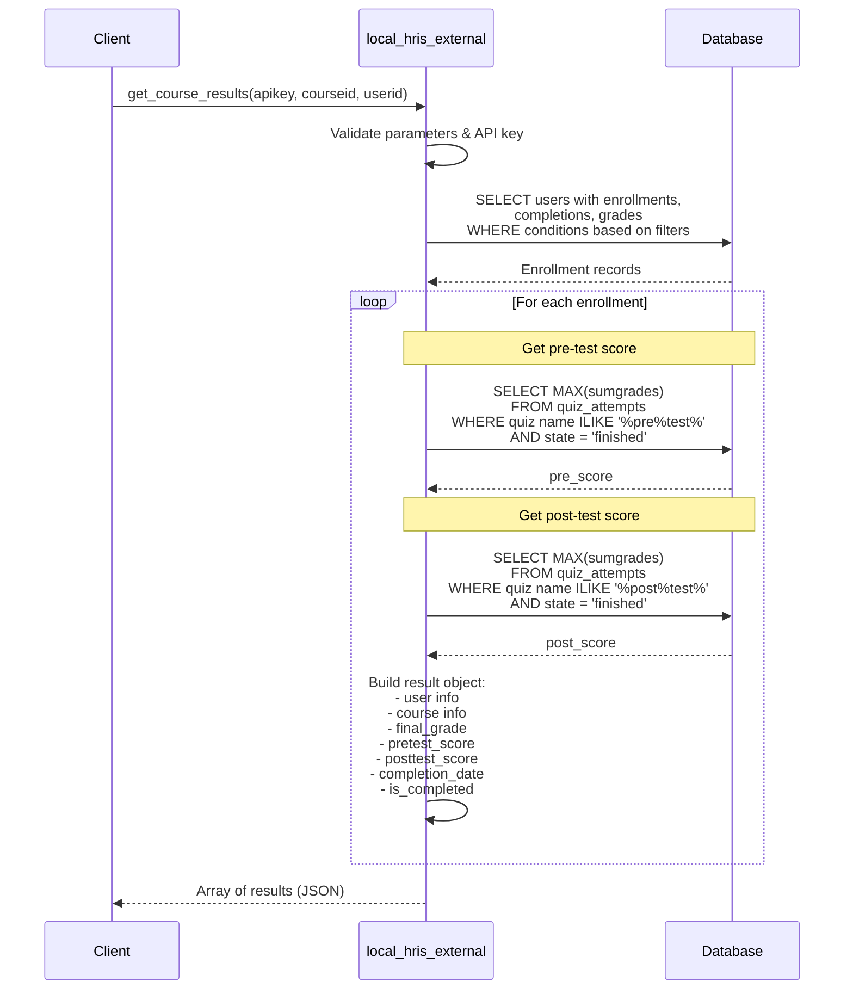
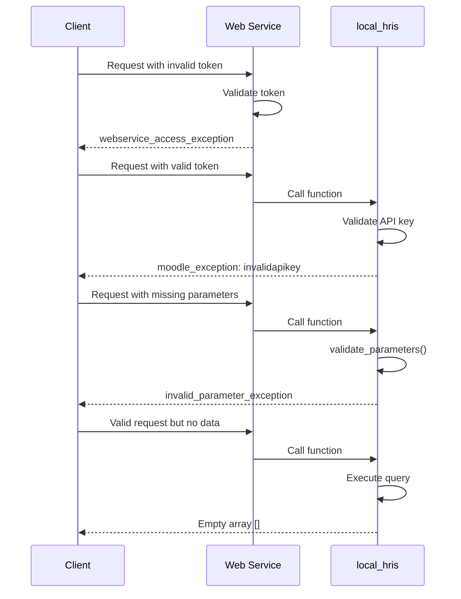
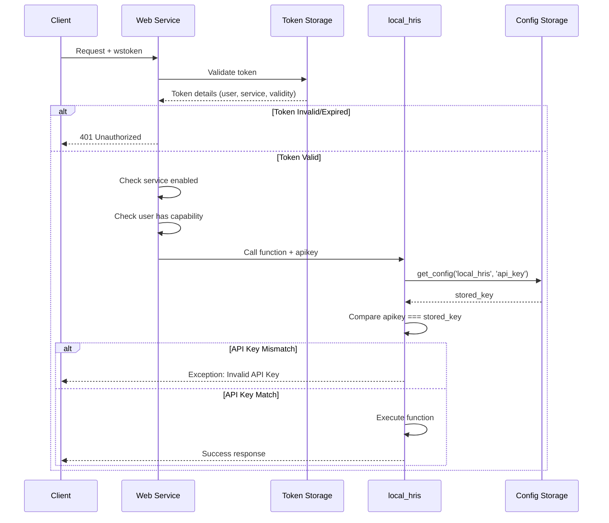

# HRIS Plugin - Design Documentation

## Table of Contents
1. [System Architecture](#system-architecture)
2. [Component Design](#component-design)
3. [Sequence Diagrams](#sequence-diagrams)
4. [Database Design](#database-design)
5. [Security Architecture](#security-architecture)
6. [API Design Patterns](#api-design-patterns)

---

## System Architecture

### High-Level Architecture

```
┌─────────────────────────────────────────────────────────────┐
│                    External Integration                      │
│                      (HRIS System)                           │
└────────────────────────┬────────────────────────────────────┘
                         │
                         │ HTTPS/REST
                         │ (POST requests)
                         ▼
┌─────────────────────────────────────────────────────────────┐
│                    Web Server Layer                          │
│                  (Apache/Nginx + SSL)                        │
└────────────────────────┬────────────────────────────────────┘
                         │
                         ▼
┌─────────────────────────────────────────────────────────────┐
│              Moodle Core Web Service Layer                   │
│                                                              │
│  ┌──────────────────────────────────────────────────┐      │
│  │  REST Protocol Handler                            │      │
│  │  - Parse incoming requests                        │      │
│  │  - Validate web service token                     │      │
│  │  - Route to appropriate function                  │      │
│  │  - Format response (JSON/XML)                     │      │
│  └────────────────────┬─────────────────────────────┘      │
│                       │                                      │
└───────────────────────┼──────────────────────────────────────┘
                        │
                        ▼
┌─────────────────────────────────────────────────────────────┐
│                 local_hris Plugin Layer                      │
│                                                              │
│  ┌──────────────────────────────────────────────────┐      │
│  │  local_hris_external Class                        │      │
│  │                                                    │      │
│  │  1. API Key Validation                            │      │
│  │  2. Parameter Validation                          │      │
│  │  3. Context Validation                            │      │
│  │  4. Business Logic Execution                      │      │
│  │  5. Data Formatting                               │      │
│  └────────────────────┬─────────────────────────────┘      │
│                       │                                      │
└───────────────────────┼──────────────────────────────────────┘
                        │
                        ▼
┌─────────────────────────────────────────────────────────────┐
│                  Moodle Data Layer                           │
│                                                              │
│  ┌──────────────┐  ┌──────────────┐  ┌──────────────┐     │
│  │   Courses    │  │    Users     │  │    Grades    │     │
│  │   Table      │  │    Table     │  │    Table     │     │
│  └──────────────┘  └──────────────┘  └──────────────┘     │
│                                                              │
│  ┌──────────────┐  ┌──────────────┐  ┌──────────────┐     │
│  │ Enrollments  │  │ Completions  │  │    Quiz      │     │
│  │   Table      │  │    Table     │  │  Attempts    │     │
│  └──────────────┘  └──────────────┘  └──────────────┘     │
└─────────────────────────────────────────────────────────────┘
```

### Request Flow Diagram

```
┌──────────┐
│  HRIS    │
│ System   │
└────┬─────┘
     │
     │ 1. POST Request
     │    - wstoken
     │    - wsfunction
     │    - apikey
     │    - parameters
     ▼
┌─────────────────┐
│  Moodle Web     │
│  Service Layer  │──────────► Validate Token
└────┬────────────┘              │
     │                            │ Valid?
     │◄───────────────────────────┘
     │
     │ 2. Route to Function
     ▼
┌─────────────────┐
│  local_hris_    │
│  external       │──────────► Validate API Key
└────┬────────────┘              │
     │                            │ Valid?
     │◄───────────────────────────┘
     │
     │ 3. Execute Business Logic
     ▼
┌─────────────────┐
│  Database       │
│  Queries        │
└────┬────────────┘
     │
     │ 4. Process Results
     ▼
┌─────────────────┐
│  Format         │
│  Response       │
└────┬────────────┘
     │
     │ 5. Return JSON/XML
     ▼
┌──────────┐
│  HRIS    │
│ System   │
└──────────┘
```

---

## Component Design

### Class Diagram

```
┌─────────────────────────────────────────────────┐
│         external_api (Moodle Core)              │
│                                                 │
│  + validate_parameters()                        │
│  + validate_context()                           │
└────────────────┬────────────────────────────────┘
                 │
                 │ extends
                 ▼
┌─────────────────────────────────────────────────┐
│         local_hris_external                     │
├─────────────────────────────────────────────────┤
│  Static Methods:                                │
│                                                 │
│  + get_active_courses_parameters()              │
│  + get_active_courses(apikey)                   │
│  + get_active_courses_returns()                 │
│                                                 │
│  + get_course_participants_parameters()         │
│  + get_course_participants(apikey, courseid)    │
│  + get_course_participants_returns()            │
│                                                 │
│  + get_course_results_parameters()              │
│  + get_course_results(apikey, courseid, userid) │
│  + get_course_results_returns()                 │
│                                                 │
│  - validate_api_key(apikey) : bool              │
│  - get_quiz_score(userid, courseid, type)       │
└─────────────────────────────────────────────────┘
```

### Function Pattern

Each API function follows this pattern:

```php
// 1. Parameter Definition
public static function {function_name}_parameters() {
    return new external_function_parameters([
        'param1' => new external_value(TYPE, 'Description'),
        'param2' => new external_value(TYPE, 'Description', VALUE_OPTIONAL, default)
    ]);
}

// 2. Function Implementation
public static function {function_name}($param1, $param2 = default) {
    // 2.1 Validate parameters
    $params = self::validate_parameters(
        self::{function_name}_parameters(), 
        ['param1' => $param1, 'param2' => $param2]
    );
    
    // 2.2 Validate API key
    if (!self::validate_api_key($params['apikey'])) {
        throw new moodle_exception('invalidapikey', 'local_hris');
    }
    
    // 2.3 Validate context
    $context = context_system::instance();
    self::validate_context($context);
    
    // 2.4 Execute business logic
    $result = // ... database queries and processing
    
    // 2.5 Return formatted data
    return $result;
}

// 3. Return Value Definition
public static function {function_name}_returns() {
    return new external_multiple_structure(
        new external_single_structure([
            'field1' => new external_value(TYPE, 'Description'),
            'field2' => new external_value(TYPE, 'Description')
        ])
    );
}
```

---

## Sequence Diagrams

### 1. Complete Request-Response Cycle



### 2. Get Active Courses - Detailed Flow



### 3. Get Course Participants - Detailed Flow



### 4. Get Course Results - Detailed Flow



### 5. Error Handling Flow



---

## Database Design

### Entity Relationship Diagram

```
┌─────────────────┐         ┌─────────────────┐
│     Course      │         │      User       │
├─────────────────┤         ├─────────────────┤
│ id (PK)         │         │ id (PK)         │
│ shortname       │         │ email           │
│ fullname        │         │ firstname       │
│ summary         │         │ lastname        │
│ startdate       │         │ deleted         │
│ enddate         │         │ confirmed       │
│ visible         │         └────────┬────────┘
└────────┬────────┘                  │
         │                           │
         │ 1                         │ 1
         │                           │
         │         N        N        │
         └──────┐         ┌─────────┘
                │         │
                ▼         ▼
         ┌──────────────────────┐
         │   User_enrolments    │
         ├──────────────────────┤
         │ id (PK)              │
         │ enrolid (FK)         │
         │ userid (FK)          │
         │ timecreated          │
         └──────────┬───────────┘
                    │
                    │ N
                    │
                    │ 1
                    ▼
         ┌──────────────────────┐
         │       Enrol          │
         ├──────────────────────┤
         │ id (PK)              │
         │ courseid (FK)        │
         │ enrol                │
         │ status               │
         └──────────────────────┘

┌─────────────────┐         ┌─────────────────┐
│ Course_         │         │  Grade_items    │
│ Completions     │         ├─────────────────┤
├─────────────────┤         │ id (PK)         │
│ userid (FK)     │         │ courseid (FK)   │
│ course (FK)     │         │ itemtype        │
│ timecompleted   │         └────────┬────────┘
└─────────────────┘                  │
                                     │ 1
                                     │
                                     │ N
                                     ▼
                          ┌─────────────────┐
                          │  Grade_grades   │
                          ├─────────────────┤
                          │ id (PK)         │
                          │ itemid (FK)     │
                          │ userid (FK)     │
                          │ finalgrade      │
                          └─────────────────┘

┌─────────────────┐         ┌─────────────────┐
│      Quiz       │         │  Quiz_attempts  │
├─────────────────┤         ├─────────────────┤
│ id (PK)         │──1:N────│ quiz (FK)       │
│ course (FK)     │         │ userid (FK)     │
│ name            │         │ sumgrades       │
└─────────────────┘         │ state           │
                            └─────────────────┘

┌─────────────────┐         ┌─────────────────┐
│ User_info_field │         │ User_info_data  │
├─────────────────┤         ├─────────────────┤
│ id (PK)         │──1:N────│ userid (FK)     │
│ shortname       │         │ fieldid (FK)    │
│ name            │         │ data            │
└─────────────────┘         └─────────────────┘
```

### Key Queries

#### Query 1: Active Courses
```sql
SELECT 
    c.id, 
    c.shortname, 
    c.fullname, 
    c.summary, 
    c.startdate, 
    c.enddate, 
    c.visible
FROM mdl_course c 
WHERE c.id != 1 
  AND c.visible = 1
ORDER BY c.fullname;
```

#### Query 2: Course Participants
```sql
SELECT DISTINCT 
    u.id,
    u.email,
    u.firstname,
    u.lastname,
    COALESCE(uid_company.data, '') as company_name,
    c.id as course_id,
    c.shortname,
    c.fullname as course_name,
    ue.timecreated as enrollment_date
FROM mdl_user u
JOIN mdl_user_enrolments ue ON u.id = ue.userid
JOIN mdl_enrol e ON ue.enrolid = e.id
JOIN mdl_course c ON e.courseid = c.id
LEFT JOIN mdl_user_info_field uif_company 
    ON uif_company.shortname = 'company'
LEFT JOIN mdl_user_info_data uid_company 
    ON u.id = uid_company.userid 
    AND uid_company.fieldid = uif_company.id
WHERE u.deleted = 0 
  AND u.confirmed = 1
  AND c.id != 1
  AND c.visible = 1
  [AND c.id = :courseid]  -- Optional filter
ORDER BY c.fullname, u.lastname, u.firstname;
```

#### Query 3: Course Results
```sql
SELECT DISTINCT 
    u.id as user_id,
    u.email,
    u.firstname,
    u.lastname,
    COALESCE(uid_company.data, '') as company_name,
    c.id as course_id,
    c.shortname,
    c.fullname as course_name,
    cc.timecompleted,
    COALESCE(gg.finalgrade, 0) as final_grade
FROM mdl_user u
JOIN mdl_user_enrolments ue ON u.id = ue.userid
JOIN mdl_enrol e ON ue.enrolid = e.id
JOIN mdl_course c ON e.courseid = c.id
LEFT JOIN mdl_course_completions cc 
    ON u.id = cc.userid 
    AND c.id = cc.course
LEFT JOIN mdl_grade_items gi 
    ON c.id = gi.courseid 
    AND gi.itemtype = 'course'
LEFT JOIN mdl_grade_grades gg 
    ON u.id = gg.userid 
    AND gi.id = gg.itemid
LEFT JOIN mdl_user_info_field uif_company 
    ON uif_company.shortname = 'company'
LEFT JOIN mdl_user_info_data uid_company 
    ON u.id = uid_company.userid 
    AND uid_company.fieldid = uif_company.id
WHERE u.deleted = 0 
  AND u.confirmed = 1
  AND c.id != 1
  AND c.visible = 1
  [AND c.id = :courseid]  -- Optional filter
  [AND u.id = :userid]    -- Optional filter
ORDER BY c.fullname, u.lastname, u.firstname;
```

#### Query 4: Quiz Scores (Pre/Post Test)
```sql
SELECT MAX(qa.sumgrades) as score
FROM mdl_quiz_attempts qa
JOIN mdl_quiz q ON qa.quiz = q.id
WHERE qa.userid = :userid
  AND q.course = :courseid
  AND q.name ILIKE :namepattern  -- '%pre%test%' or '%post%test%'
  AND qa.state = 'finished';
```

---

## Security Architecture

### Defense in Depth Strategy

```
Layer 1: Network Security
┌─────────────────────────────────────────┐
│ • Firewall rules                        │
│ • IP whitelisting                       │
│ • DDoS protection                       │
│ • Rate limiting                         │
└─────────────────────────────────────────┘
                 ↓
Layer 2: Transport Security
┌─────────────────────────────────────────┐
│ • HTTPS/TLS 1.2+                        │
│ • Valid SSL certificate                 │
│ • Strong cipher suites                  │
└─────────────────────────────────────────┘
                 ↓
Layer 3: Application Security
┌─────────────────────────────────────────┐
│ • Web service token validation          │
│ • Token expiration                      │
│ • User authentication                   │
└─────────────────────────────────────────┘
                 ↓
Layer 4: Plugin Security
┌─────────────────────────────────────────┐
│ • Custom API key validation             │
│ • API enable/disable toggle             │
│ • Request logging                       │
└─────────────────────────────────────────┘
                 ↓
Layer 5: Data Security
┌─────────────────────────────────────────┐
│ • Parameter type validation             │
│ • SQL injection prevention              │
│ • XSS protection                        │
│ • Context validation                    │
└─────────────────────────────────────────┘
                 ↓
Layer 6: Business Logic Security
┌─────────────────────────────────────────┐
│ • Capability checks                     │
│ • Data visibility rules                 │
│ • Audit logging                         │
└─────────────────────────────────────────┘
```

### Authentication Sequence



---

## API Design Patterns

### RESTful Principles

1. **Resource-Oriented**: Each function represents a resource
   - `/courses` → get_active_courses
   - `/participants` → get_course_participants
   - `/results` → get_course_results

2. **Stateless**: Each request is independent
   - No session management
   - All auth info in each request

3. **Cacheable**: Responses can be cached
   - Use HTTP cache headers
   - Data changes infrequently

4. **Uniform Interface**: Consistent patterns
   - Same authentication for all endpoints
   - Same error format
   - Same response structure

### Response Patterns

#### Success Response Pattern
```json
{
  "type": "array",
  "items": {
    "type": "object",
    "properties": {
      "id": "integer",
      "name": "string",
      ...
    }
  }
}
```

#### Error Response Pattern
```json
{
  "exception": "exception_class",
  "errorcode": "error_code",
  "message": "Human readable message"
}
```

### Pagination Considerations

For future versions, pagination would follow this pattern:

```php
public static function get_active_courses_parameters() {
    return new external_function_parameters([
        'apikey' => new external_value(PARAM_TEXT, 'API key'),
        'page' => new external_value(PARAM_INT, 'Page number', VALUE_DEFAULT, 1),
        'perpage' => new external_value(PARAM_INT, 'Items per page', VALUE_DEFAULT, 50)
    ]);
}
```

Response with pagination:
```json
{
  "data": [...],
  "pagination": {
    "page": 1,
    "perpage": 50,
    "total": 150,
    "pages": 3
  }
}
```

---

## Performance Considerations

### Query Optimization

1. **Use Indexes**: Ensure proper database indexes
   ```sql
   CREATE INDEX idx_course_visible ON mdl_course(visible, id);
   CREATE INDEX idx_user_deleted_confirmed ON mdl_user(deleted, confirmed);
   ```

2. **Limit Result Sets**: Use LIMIT in queries when appropriate

3. **Avoid N+1 Queries**: Use JOINs instead of loops with individual queries

4. **Cache Results**: Use Moodle's cache API for frequently accessed data

### Scalability

```
┌────────────────────────────────────────────┐
│         Load Balancing Strategy            │
├────────────────────────────────────────────┤
│                                            │
│  Multiple Web Servers                      │
│  ├── Server 1 (API requests)               │
│  ├── Server 2 (API requests)               │
│  └── Server 3 (API requests)               │
│                                            │
│  Single Database (with replication)        │
│  ├── Master (writes)                       │
│  └── Slaves (reads)                        │
│                                            │
│  Redis Cache Layer                         │
│  └── Shared cache for all servers          │
└────────────────────────────────────────────┘
```

---

## Monitoring & Logging

### Logging Strategy

```php
// Enable web service logging in Moodle
// Site Admin → Development → Debugging

// Custom logging in plugin
debugging('HRIS API: ' . $function_name . ' called', DEBUG_DEVELOPER);

// Log to Moodle logs
add_to_log(
    SITEID, 
    'webservice', 
    'function_call',
    '', 
    $function_name
);
```

### Metrics to Monitor

1. **API Usage**
   - Requests per hour/day
   - Most called functions
   - Response times

2. **Error Rates**
   - Failed authentication attempts
   - Invalid API key attempts
   - Exception frequency

3. **Performance**
   - Average response time
   - Slow query detection
   - Database load

4. **Security**
   - Suspicious access patterns
   - IP-based anomalies
   - Token usage patterns

---

## Future Enhancements

### Phase 2: Advanced Features
1. Webhook support for real-time updates
2. Batch operations (bulk enrollment)
3. Custom report generation
4. Certificate download endpoint

### Phase 3: Enterprise Features
1. OAuth 2.0 authentication
2. GraphQL API option
3. Advanced analytics dashboard
4. Multi-tenant support

### Phase 4: Integration Ecosystem
1. Pre-built HRIS connectors
2. Middleware service
3. SDK libraries (PHP, Python, Node.js)
4. Postman collections

---

## Appendix

### Glossary

- **API Key**: Custom authentication token specific to HRIS plugin
- **Web Service Token**: Moodle's standard token for web service access
- **External API**: Moodle's web service function class
- **Context**: Moodle's permission scope (system, course, user)
- **PARAM_**: Moodle's parameter type constants for validation

### References

- [Moodle Web Services Documentation](https://docs.moodle.org/dev/Web_services)
- [External Functions API](https://docs.moodle.org/dev/External_functions_API)
- [Moodle Database API](https://docs.moodle.org/dev/Data_manipulation_API)

---

**Last Updated**: 2025-01-05  
**Version**: 1.0  
**Author**: Prihantoosa
