# HRIS Plugin - Sequence Diagrams

This document contains all sequence diagrams for the HRIS Integration Plugin in Mermaid format.

## Table of Contents
1. [Complete Request-Response Cycle](#1-complete-request-response-cycle)
2. [Get Active Courses Flow](#2-get-active-courses-flow)
3. [Get Course Participants Flow](#3-get-course-participants-flow)
4. [Get Course Results Flow](#4-get-course-results-flow)
5. [Authentication Flow](#5-authentication-flow)
6. [Error Handling Flow](#6-error-handling-flow)

---

## 1. Complete Request-Response Cycle

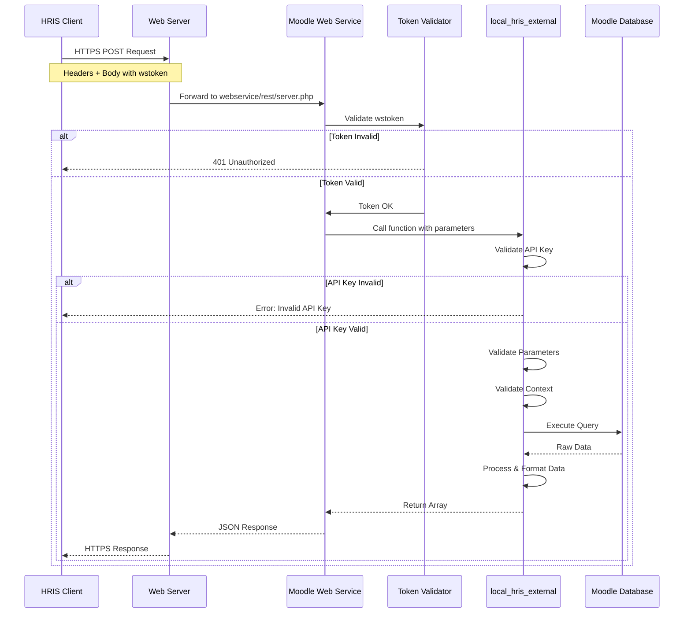

---

## 2. Get Active Courses Flow

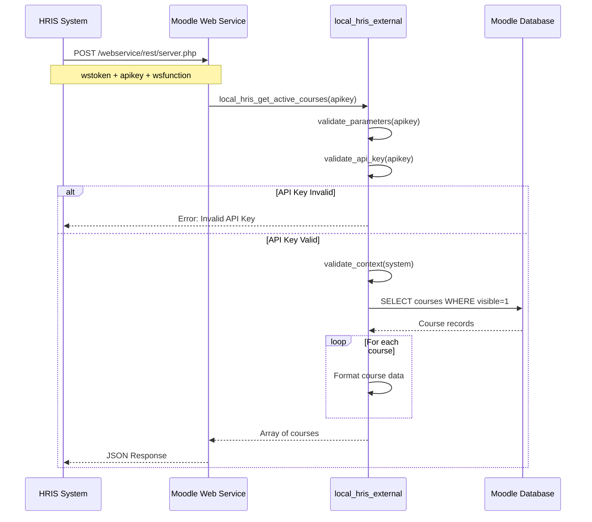

### Detailed Flow with Validation

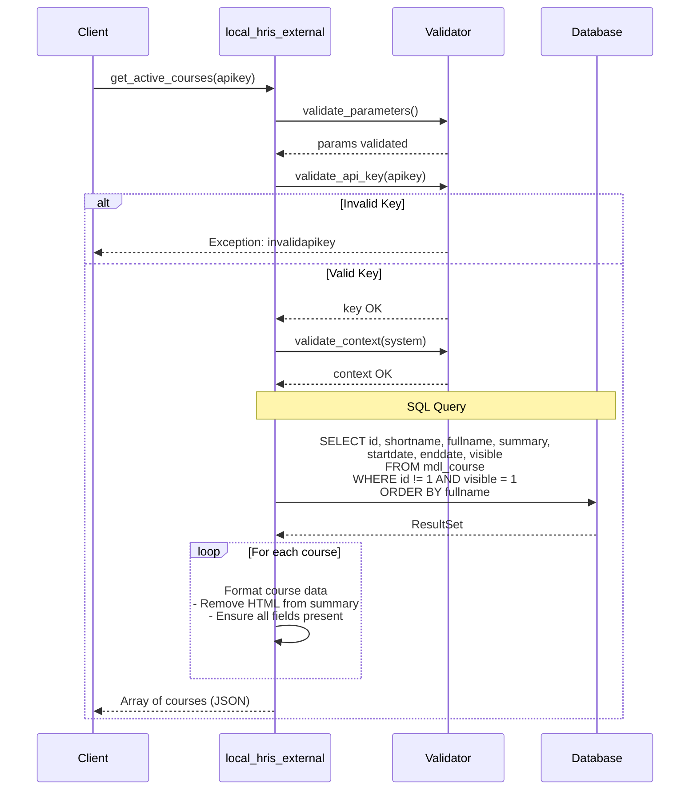

---

## 3. Get Course Participants Flow

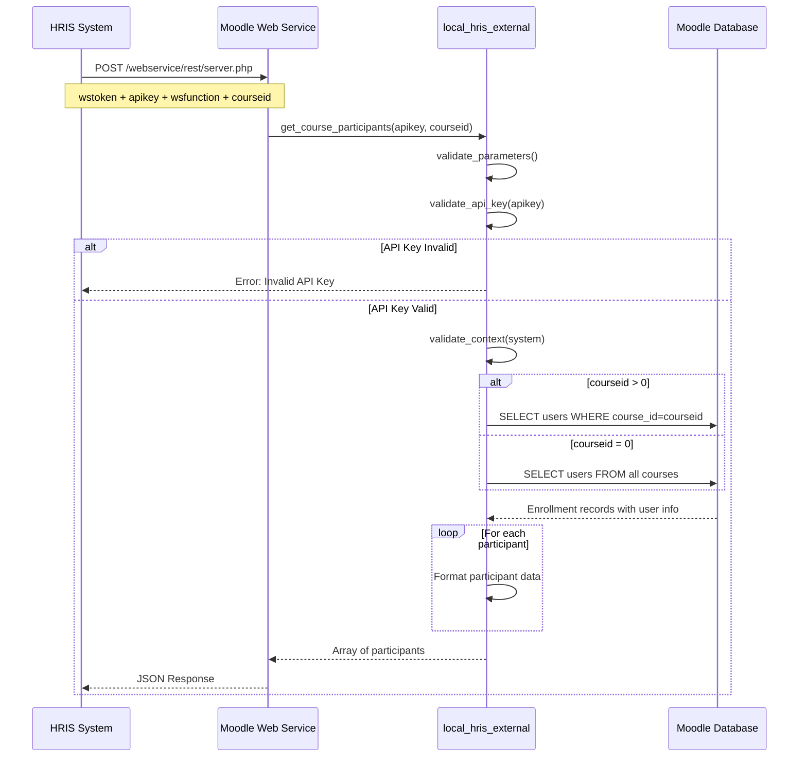

### Detailed Flow with Filtering

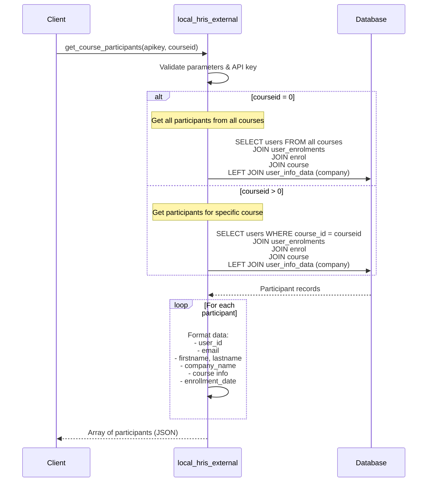

---

## 4. Get Course Results Flow

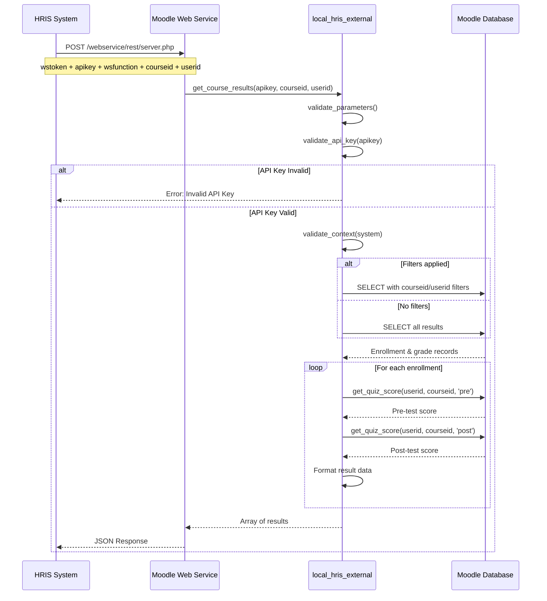

### Detailed Flow with Score Calculation

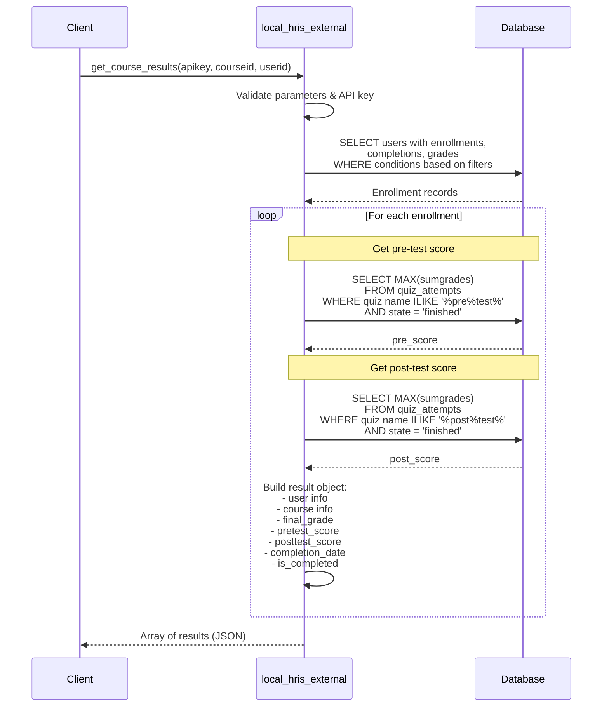

---

## 5. Authentication Flow

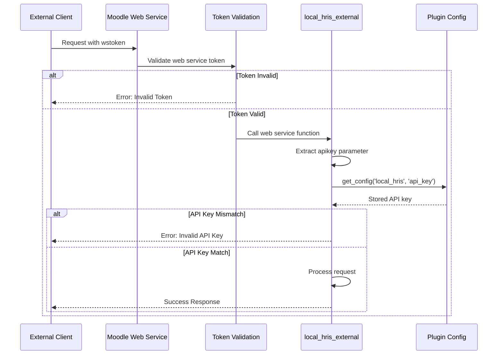

### Detailed Authentication with User Context

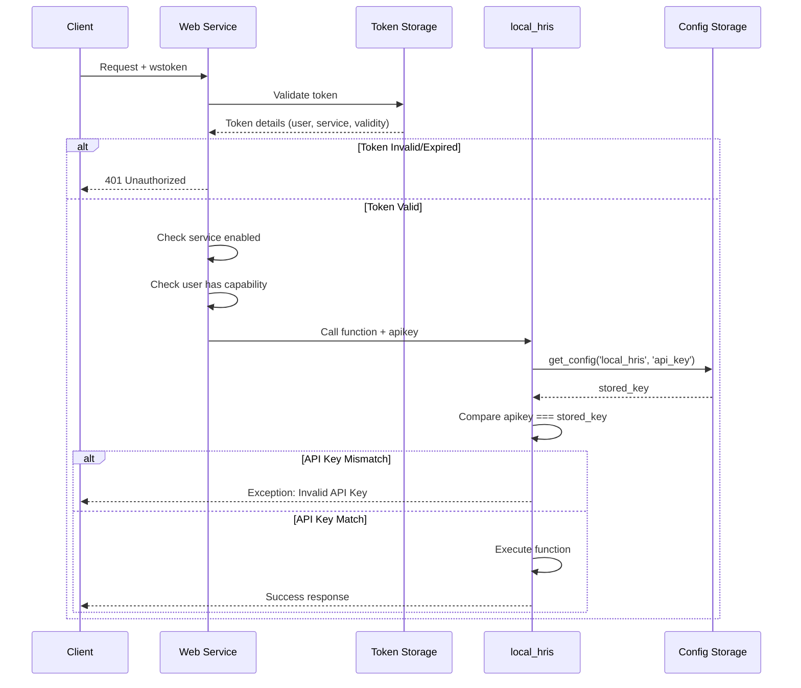

---

## 6. Error Handling Flow

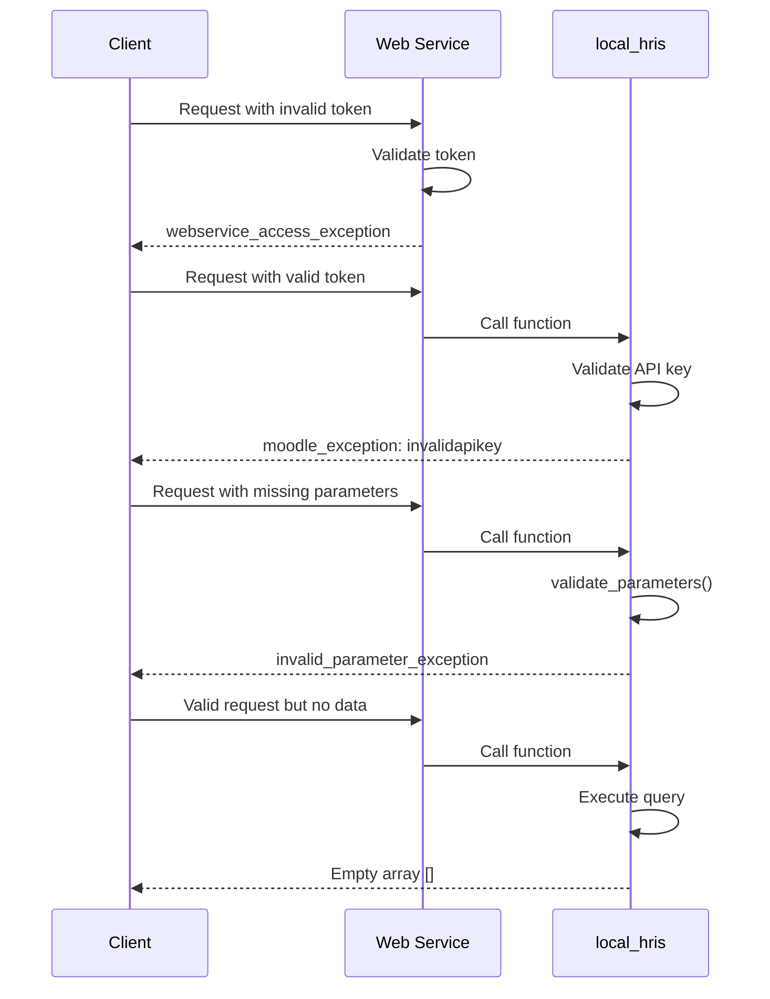

### Detailed Error Scenarios

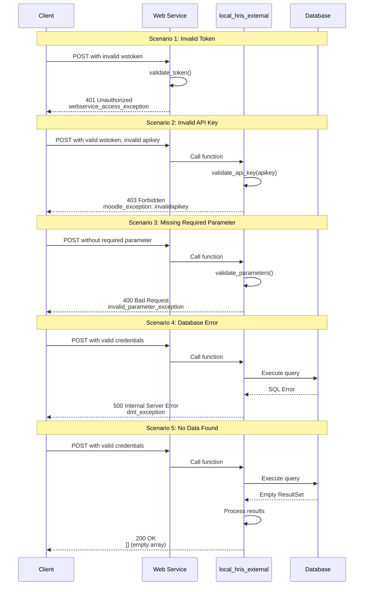

---

## Usage Instructions

### Viewing Diagrams

These diagrams use Mermaid syntax. To view them:

1. **GitHub**: GitHub automatically renders Mermaid diagrams in markdown files
2. **VS Code**: Install the "Markdown Preview Mermaid Support" extension
3. **Online**: Copy to [Mermaid Live Editor](https://mermaid.live/)
4. **Documentation Sites**: Use MkDocs with mermaid2 plugin

### Editing Diagrams

To modify these diagrams:

1. Use the Mermaid syntax reference: https://mermaid.js.org/
2. Test changes in the Mermaid Live Editor
3. Common elements:
   - `participant`: Define an actor in the sequence
   - `->`: Solid arrow (synchronous call)
   - `-->>`: Dashed arrow (return/response)
   - `Note over`: Add notes above actors
   - `alt/else/end`: Conditional logic
   - `loop/end`: Repetitive logic

### Exporting Diagrams

To export as images:

1. Use Mermaid CLI: `mmdc -i DIAGRAMS.md -o diagram.png`
2. Or use the Mermaid Live Editor's export function
3. Or use VS Code with Mermaid export extension

---

## Integration with Documentation

These diagrams are referenced in:
- [README.md](README.md) - Main documentation
- [DESIGN.md](DESIGN.md) - Detailed design documentation

---

**Last Updated**: 2025-01-05  
**Version**: 1.0  
**Author**: Prihantoosa
