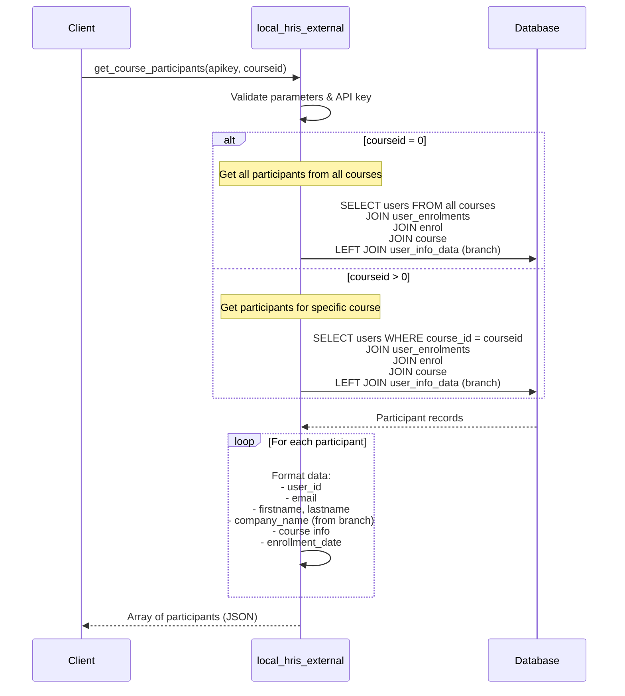
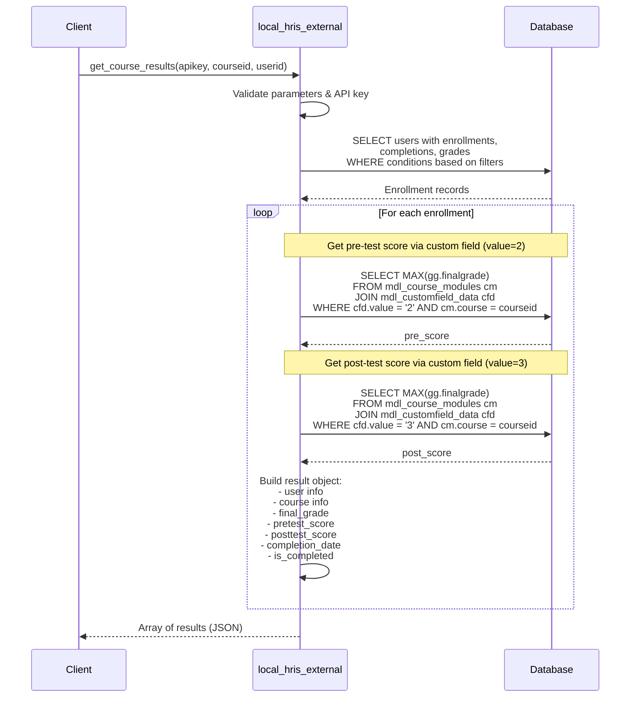
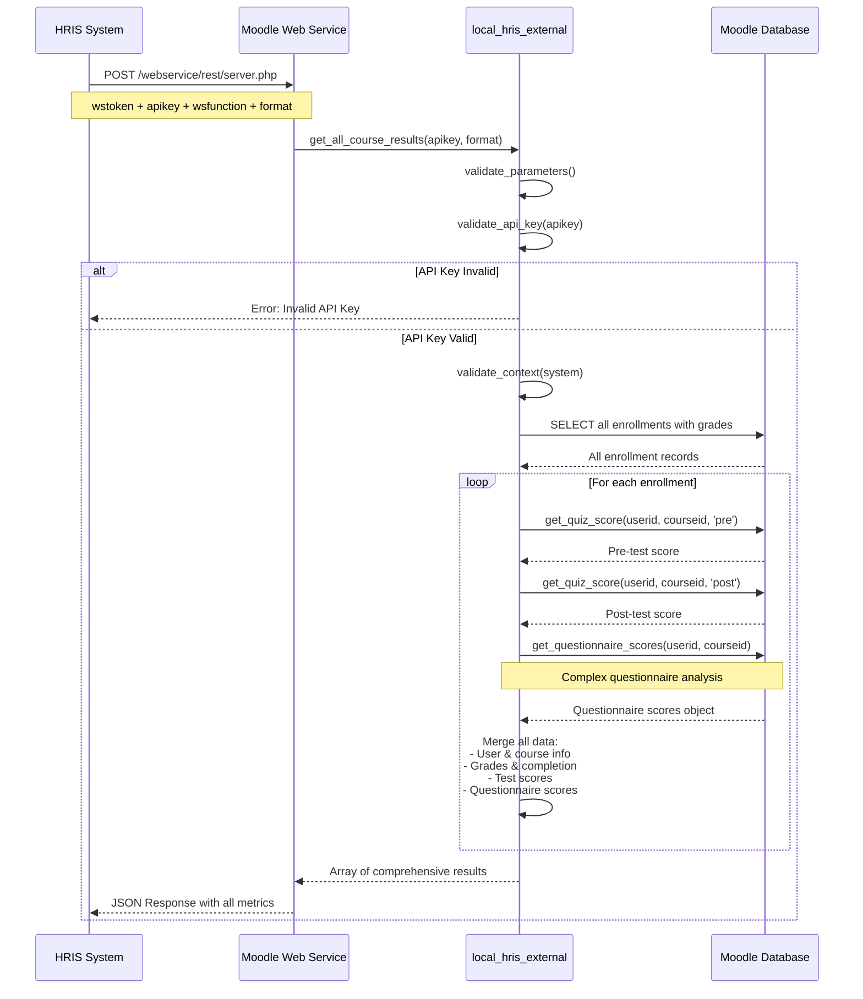
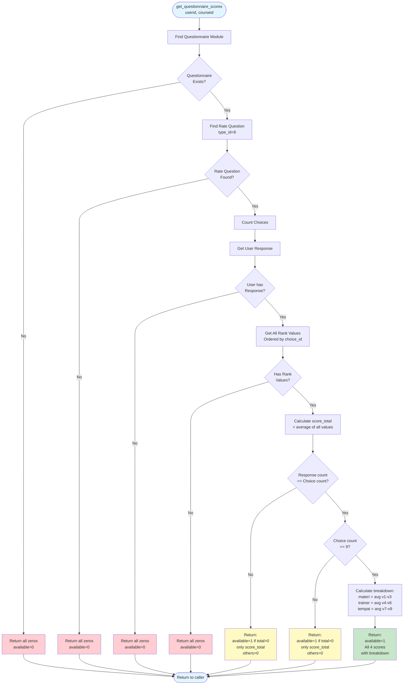

# HRIS Plugin - Sequence Diagrams

This document contains all sequence diagrams for the HRIS Integration Plugin in Mermaid format.

## Table of Contents
1. [Complete Request-Response Cycle](#1-complete-request-response-cycle)
2. [Get Active Courses Flow](#2-get-active-courses-flow)
3. [Get Course Participants Flow](#3-get-course-participants-flow)
4. [Get Course Results Flow](#4-get-course-results-flow)
5. [Get All Course Results Flow (with Questionnaire)](#5-get-all-course-results-flow-with-questionnaire)
6. [Questionnaire Scoring Flow](#6-questionnaire-scoring-flow)
7. [Authentication Flow](#7-authentication-flow)
8. [Error Handling Flow](#8-error-handling-flow)

---

## 1. Complete Request-Response Cycle


---

## 2. Get Active Courses Flow


### Detailed Flow with Validation


---

## 3. Get Course Participants Flow


### Detailed Flow with Filtering



---

## 4. Get Course Results Flow


### Detailed Flow with Score Calculation



---

## 5. Get All Course Results Flow (with Questionnaire)



### Detailed Flow with All Metrics

```mermaid
sequenceDiagram
    participant Client
    participant API as local_hris_external
    participant Helper as Helper Methods
    participant DB as Database
    
    Client->>API: get_all_course_results(apikey, format='json')
    
    API->>API: Validate parameters & API key & context
    
    API->>DB: SELECT u.id, u.email, u.firstname, u.lastname,<br/>c.id, c.shortname, c.fullname,<br/>cc.timecompleted, gg.finalgrade<br/>FROM users JOIN enrollments JOIN courses<br/>LEFT JOIN completions, grades, user_info
    
    DB-->>API: All enrollment records
    
    loop For each (user, course) pair
        Note over API,Helper: Calculate Pre-test Score
        API->>Helper: get_quiz_score(userid, courseid, 'pre')
        Helper->>DB: SELECT MAX(finalgrade)<br/>WHERE custom_field.value = '2'
        DB-->>Helper: pretest_score
        Helper-->>API: pretest_score (0.00 if none)
        
        Note over API,Helper: Calculate Post-test Score
        API->>Helper: get_quiz_score(userid, courseid, 'post')
        Helper->>DB: SELECT MAX(finalgrade)<br/>WHERE custom_field.value = '3'
        DB-->>Helper: posttest_score
        Helper-->>API: posttest_score (0.00 if none)
        
        Note over API,Helper: Calculate Questionnaire Scores
        API->>Helper: get_questionnaire_scores(userid, courseid)
        Helper->>Helper: See Questionnaire Scoring Flow (Section 6)
        Helper-->>API: {
            questionnaire_available,
            score_materi,
            score_trainer,
            score_tempat,
            score_total
        }
        
        API->>API: Merge into result object:
        Note over API: course_id, course_name, course_shortname,<br/>user_id, firstname, lastname, email,<br/>company_name, final_grade,<br/>pretest_score, posttest_score,<br/>completion_date, is_completed,<br/>questionnaire_available,<br/>score_materi, score_trainer,<br/>score_tempat, score_total
    end
    
    API-->>Client: Array of comprehensive results (JSON)
```

---

## 6. Questionnaire Scoring Flow

### Complete Questionnaire Analysis Process

```mermaid
sequenceDiagram
    participant API as get_questionnaire_scores()
    participant DB as Database
    
    Note over API: Initialize default response:<br/>all scores = 0, available = 0
    
    API->>DB: Find questionnaire module
    Note over DB: SELECT cm.id, q.id<br/>FROM course_modules cm<br/>JOIN modules m (name='questionnaire')<br/>JOIN questionnaire q<br/>WHERE course = courseid AND visible = 1
    
    alt No questionnaire found
        DB-->>API: NULL
        API-->>API: Return default (all zeros)
    else Questionnaire exists
        DB-->>API: questionnaire_id
        
        API->>DB: Find Rate question (type_id=8)
        Note over DB: SELECT * FROM questionnaire_question<br/>WHERE surveyid = questionnaire_id<br/>AND type_id = 8 (QUESRATE)
        
        alt No Rate question
            DB-->>API: NULL
            API-->>API: Return default (all zeros)
        else Rate question found
            DB-->>API: rate_question_id
            
            API->>DB: Count choices
            Note over DB: SELECT COUNT(*)<br/>FROM questionnaire_quest_choice<br/>WHERE question_id = rate_question_id
            DB-->>API: choice_count
            
            API->>DB: Get user's response
            Note over DB: SELECT * FROM questionnaire_response<br/>WHERE questionnaireid = questionnaire_id<br/>AND userid = userid
            
            alt No response from user
                DB-->>API: NULL
                API-->>API: Return default (all zeros)
            else Response exists
                DB-->>API: response_id
                
                API->>DB: Get all rating values
                Note over DB: SELECT qrr.rankvalue<br/>FROM questionnaire_response_rank qrr<br/>JOIN questionnaire_quest_choice qqc<br/>WHERE response_id = response_id<br/>AND question_id = rate_question_id<br/>ORDER BY qqc.id ASC
                
                DB-->>API: Array of rankvalues [v1, v2, ..., vN]
                
                alt Empty responses
                    API-->>API: Return default (all zeros)
                else Has responses
                    API->>API: Calculate score_total = average(all values)
                    
                    alt Response count != choice count
                        Note over API: Mismatch detected
                        API-->>API: Return {
                            questionnaire_available: 1 if total > 0,
                            score_materi: 0,
                            score_trainer: 0,
                            score_tempat: 0,
                            score_total: calculated
                        }
                    else choice_count == 9
                        Note over API: Perfect match with 9 choices
                        API->>API: score_materi = avg(v1, v2, v3)
                        API->>API: score_trainer = avg(v4, v5, v6)
                        API->>API: score_tempat = avg(v7, v8, v9)
                        API-->>API: Return {
                            questionnaire_available: 1,
                            score_materi: calculated,
                            score_trainer: calculated,
                            score_tempat: calculated,
                            score_total: calculated
                        }
                    else Other choice count
                        Note over API: Valid but not 9 choices
                        API-->>API: Return {
                            questionnaire_available: 1 if total > 0,
                            score_materi: 0,
                            score_trainer: 0,
                            score_tempat: 0,
                            score_total: calculated
                        }
                    end
                end
            end
        end
    end
```

### Questionnaire Scoring Decision Tree



---

## 7. Authentication Flow


### Detailed Authentication with User Context


---

## 8. Error Handling Flow


### Detailed Error Scenarios


---

## Usage Instructions

### Viewing Diagrams

These diagrams use Mermaid syntax. To view them:

1. **GitHub**: GitHub automatically renders Mermaid diagrams in markdown files
2. **VS Code**: Install the "Markdown Preview Mermaid Support" extension
3. **Online**: Copy to [Mermaid Live Editor](https://mermaid.live/)
4. **Documentation Sites**: Use MkDocs with mermaid2 plugin

### Editing Diagrams

To modify these diagrams:

1. Use the Mermaid syntax reference: https://mermaid.js.org/
2. Test changes in the Mermaid Live Editor
3. Common elements:
   - `participant`: Define an actor in the sequence
   - `->`: Solid arrow (synchronous call)
   - `-->>`: Dashed arrow (return/response)
   - `Note over`: Add notes above actors
   - `alt/else/end`: Conditional logic
   - `loop/end`: Repetitive logic

### Exporting Diagrams

To export as images:

1. Use Mermaid CLI: `mmdc -i DIAGRAMS.md -o diagram.png`
2. Or use the Mermaid Live Editor's export function
3. Or use VS Code with Mermaid export extension

---

## Integration with Documentation

These diagrams are referenced in:
- [README.md](README.md) - Main documentation
- [DESIGN.md](DESIGN.md) - Detailed design documentation

---

**Last Updated**: 2026-02-01  
**Version**: 1.1  
**Author**: Prihantoosa

## Changelog

### Version 1.1 (2026-02-01)
- Added Get All Course Results Flow with questionnaire integration
- Added comprehensive Questionnaire Scoring Flow with decision tree
- Added detailed sequence diagrams for questionnaire analysis
- Added flowchart for questionnaire scoring logic
- Updated all section numbering

### Version 1.0 (2025-01-05)
- Initial release with basic API flows
- Authentication and error handling diagrams
