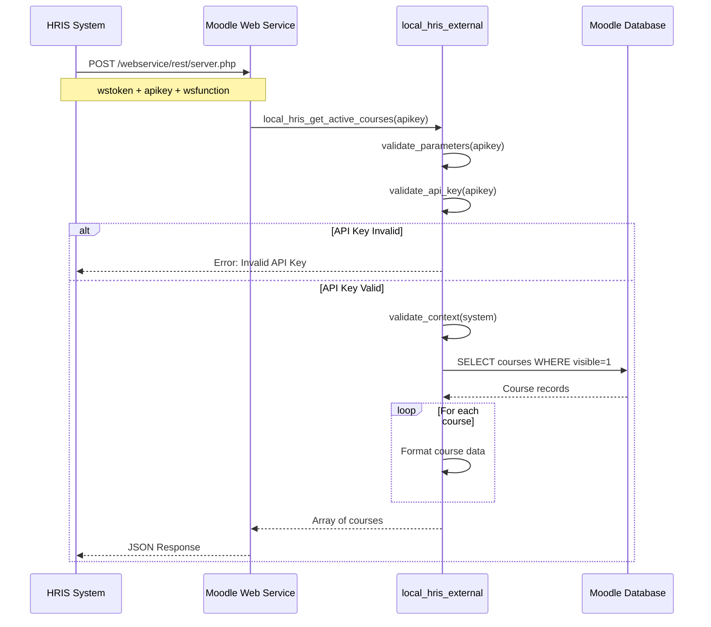
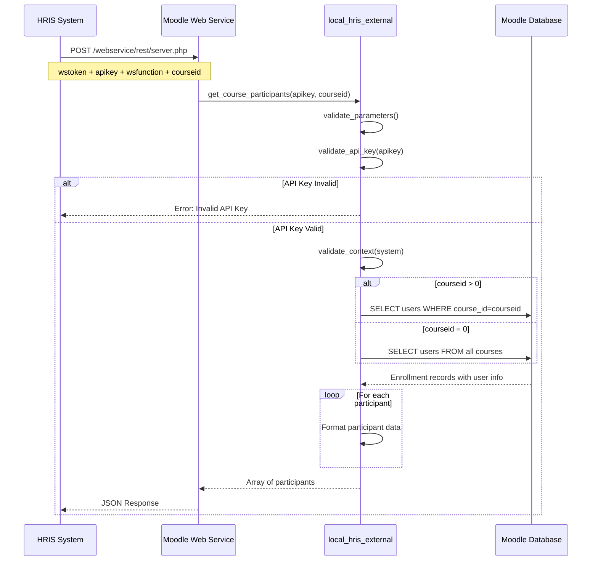
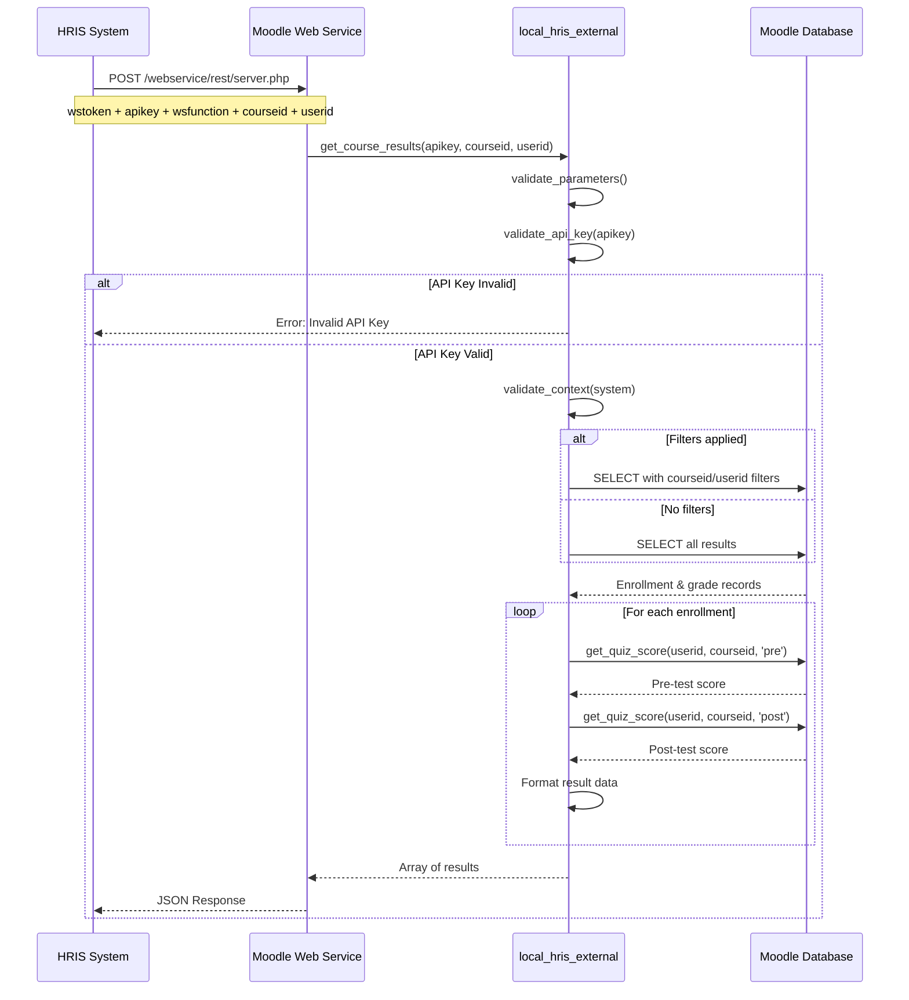
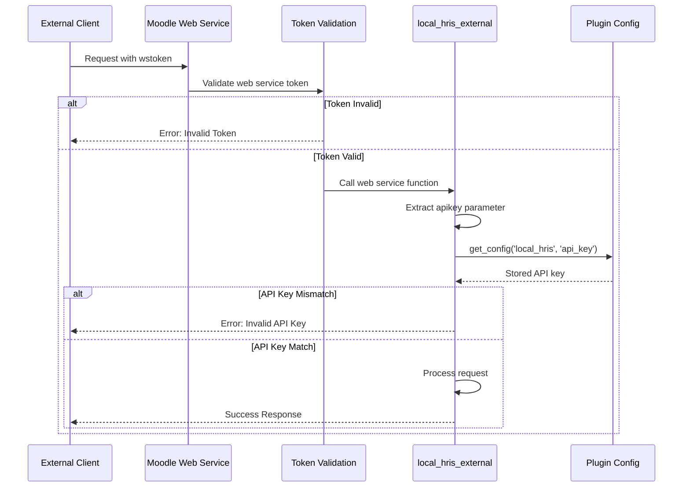

# Moodle HRIS Integration Plugin (local_hris)

A comprehensive web service plugin for Moodle that provides REST API endpoints for HRIS (Human Resource Information System) integration.


## 📚 Documentation

- **[📘 Complete Design Documentation](DESIGN.md)** - Architecture, sequence diagrams, database design
- **[📊 Sequence Diagrams](DIAGRAMS.md)** - Visual flow diagrams in Mermaid format  
- **[⚡ Quick Reference](QUICKREF.md)** - Fast lookup guide for daily use
- **[📖 API Reference](#-api-endpoints)** - Endpoint documentation below
- **[🛠️ Installation Guide](#%EF%B8%8F-installation)** - Setup instructions below
- **[🔒 Security Model](#-security)** - Multi-layer security architecture below

## 📐 Architecture & Design

### System Architecture

```
┌─────────────────────┐
│   HRIS System       │
│  (External Client)  │
└──────────┬──────────┘
           │ HTTPS/REST
           ▼
┌─────────────────────┐
│   Moodle Web        │
│   Service Layer     │
│  (REST Protocol)    │
└──────────┬──────────┘
           │
           ▼
┌─────────────────────┐
│   local_hris        │
│   External API      │
│  (Authentication    │
│   & Validation)     │
└──────────┬──────────┘
           │
           ▼
┌─────────────────────┐
│   Moodle Database   │
│  (courses, users,   │
│   grades, etc)      │
└─────────────────────┘
```

### Component Diagram

```
┌────────────────────────────────────────────────────┐
│            local_hris Plugin                       │
│                                                    │
│  ┌──────────────────────────────────────────┐    │
│  │  external.php (External API Class)       │    │
│  │                                           │    │
│  │  • validate_api_key()                    │    │
│  │  • get_active_courses()                  │    │
│  │  • get_course_participants()             │    │
│  │  • get_course_results()                  │    │
│  │  • get_all_course_results()              │    │
│  │  • get_quiz_score() [private]            │    │
│  │  • get_questionnaire_scores() [private]  │    │
│  └───────────────┬──────────────────────────┘    │
│                  │                                │
│  ┌───────────────▼──────────────────────────┐    │
│  │  services.php (Service Definitions)      │    │
│  │                                           │    │
│  │  • Function mappings                     │    │
│  │  • Service configuration                 │    │
│  │  • Capabilities & permissions            │    │
│  └──────────────────────────────────────────┘    │
│                                                    │
│  ┌──────────────────────────────────────────┐    │
│  │  settings.php (Admin Configuration)      │    │
│  │                                           │    │
│  │  • Enable/Disable API                    │    │
│  │  • API Key management                    │    │
│  └──────────────────────────────────────────┘    │
└────────────────────────────────────────────────────┘
```

```

### Sequence Diagrams

#### 1. Get Active Courses Flow



#### 2. Get Course Participants Flow



#### 3. Get Course Results Flow



#### 4. Authentication Flow



### Data Flow Architecture

```
┌─────────────────────────────────────────────────┐
│              Request Flow                        │
└─────────────────────────────────────────────────┘

1. HRIS System → Moodle Web Service Endpoint
   ├── Method: POST
   ├── Content-Type: application/x-www-form-urlencoded
   ├── Parameters: wstoken, wsfunction, apikey, [other params]
   └── Format: JSON/XML

2. Moodle Web Service Layer
   ├── Validate web service token
   ├── Check service enabled
   ├── Verify function exists
   └── Route to external function

3. local_hris External API
   ├── Validate API key (custom security)
   ├── Validate parameters (type checking)
   ├── Validate context (system context)
   └── Execute business logic

4. Database Queries
   ├── Execute SQL queries
   ├── Join necessary tables
   ├── Apply filters (courseid, userid)
   └── Return raw data

5. Data Processing
   ├── Format data according to structure
   ├── Calculate scores (pre/post test)
   ├── Apply data transformations
   └── Build response array

6. Response Flow
   └── JSON/XML Response → HRIS System
```

### Security Model

```
┌─────────────────────────────────────────────────┐
│         Security Layers                          │
└─────────────────────────────────────────────────┘

Layer 1: Transport Security
├── HTTPS encryption (SSL/TLS)
└── Secure communication channel

Layer 2: Moodle Web Service Token
├── Token-based authentication
├── Token associated with user account
├── Token permissions and capabilities
└── Token expiration (if configured)

Layer 3: Plugin API Key
├── Custom API key validation
├── Stored in Moodle config
├── Validated on every request
└── Additional security layer

Layer 4: Context & Capability Validation
├── System context validation
├── User permissions check
└── Data visibility rules

Layer 5: Parameter Validation
├── Type checking (PARAM_INT, PARAM_TEXT, etc)
├── Required parameter enforcement
└── SQL injection prevention
```

## 🌟 Features

- **Secure API Access**: API key-based authentication for secure data access
- **Active Course Listing**: Get all visible/active courses with details
- **Participant Management**: Retrieve enrolled participants by course or globally
- **Learning Results**: Comprehensive learning outcomes with pre-test, post-test, and questionnaire scores
- **Multi-language Support**: English and Indonesian language packs included
- **REST API Compatible**: Standard Moodle web service architecture

## 🚀 API Endpoints

### API Function Overview

| Function | Type | Parameters | Purpose |
|----------|------|------------|---------|
| `local_hris_get_active_courses` | Read | apikey | Get all visible courses |
| `local_hris_get_course_participants` | Read | apikey, courseid | Get enrolled participants |
| `local_hris_get_course_results` | Read | apikey, courseid, userid | Get learning results with scores |
| `local_hris_get_all_course_results` | Read | apikey, courseid | Get results with questionnaire scores |

### 1. Get Active Courses
**Function**: `local_hris_get_active_courses`

Returns list of all visible/active courses in the system.

**Response Fields**:
- `id`: Course ID
- `shortname`: Course short name
- `fullname`: Course full name  
- `summary`: Course description (stripped of HTML)
- `startdate`: Course start timestamp
- `enddate`: Course end timestamp
- `visible`: Course visibility flag

### 2. Get Course Participants
**Function**: `local_hris_get_course_participants`

Get enrolled participants in courses.

**Parameters**:
- `courseid` (optional): Specific course ID (0 for all courses)

**Response Fields**:
- `user_id`: User ID
- `email`: User email address
- `firstname`: User first name
- `lastname`: User last name
- `company_name`: Branch/organization name (from user profile field `branch`)
- `course_id`: Course ID
- `course_shortname`: Course short name
- `course_name`: Course full name
- `enrollment_date`: Enrollment timestamp

### 3. Get Course Results
**Function**: `local_hris_get_course_results`

Comprehensive learning results with assessment scores.

**Parameters**:
- `courseid` (optional): Specific course ID (0 for all courses)
- `userid` (optional): Specific user ID (0 for all users)

**Response Fields**:
- `user_id`: User ID
- `email`: User email address
- `firstname`: User first name
- `lastname`: User last name
- `company_name`: Branch/organization name (from custom field `branch`)
- `course_id`: Course ID
- `course_shortname`: Course short name
- `course_name`: Course full name
- `final_grade`: Overall course grade
- `pretest_score`: Pre-test quiz score (custom field `jenis_quiz` value = 2)
- `posttest_score`: Post-test quiz score (custom field `jenis_quiz` value = 3)
- `completion_date`: Course completion timestamp (0 if not completed)
- `is_completed`: Completion status (1 = completed, 0 = not completed)

### 4. Get All Course Results (with Questionnaire Scores)
**Function**: `local_hris_get_all_course_results`

Aggregated learning results including questionnaire scores per user and course.

**Parameters**:
- `courseid` (optional): Specific course ID (0 for all courses)

**Response Fields**:
- `course_id`: Course ID
- `course_name`: Course full name
- `course_shortname`: Course short name
- `user_id`: User ID
- `firstname`: User first name
- `lastname`: User last name
- `email`: User email address
- `company_name`: Branch/organization name (from custom field `branch`)
- `final_grade`: Overall course grade
- `pretest_score`: Pre-test quiz score (custom field `jenis_quiz` value = 2)
- `posttest_score`: Post-test quiz score (custom field `jenis_quiz` value = 3)
- `completion_date`: Course completion timestamp (0 if not completed)
- `is_completed`: Completion status (1 = completed, 0 = not completed)
- `questionnaire_available`: 1 if questionnaire scores available, otherwise 0
- `score_materi`: Average score of questions 1–3 (Material)
- `score_trainer`: Average score of questions 4–6 (Trainer)
- `score_tempat`: Average score of questions 7–9 (Venue)
- `score_total`: Overall average score (all choices)

### Database Schema Reference

#### Key Tables Used

```sql
-- Courses
{course}
├── id (Course ID)
├── shortname
├── fullname
├── summary
├── startdate
├── enddate
└── visible

-- User Enrollments
{user_enrolments}
├── userid
├── enrolid
└── timecreated

-- Enrolment Methods
{enrol}
├── id
├── courseid
└── status

-- Users
{user}
├── id
├── email
├── firstname
├── lastname
├── deleted
└── confirmed

-- User Custom Fields
{user_info_field}
├── id
├── shortname (e.g., 'branch')
└── name

{user_info_data}
├── userid
├── fieldid
└── data (field value)

-- Course Modules
{course_modules}
├── id
├── course
├── module
└── instance

{modules}
├── id
└── name

-- Course Module Custom Fields
{customfield_data}
├── instanceid (course_modules.id)
├── fieldid
└── value (1=Normal, 2=PreTest, 3=PostTest)

-- Course Completion
{course_completions}
├── userid
├── course
└── timecompleted

-- Grades
{grade_items}
├── id
├── courseid
└── itemtype

{grade_grades}
├── userid
├── itemid
└── finalgrade

-- Questionnaire
{questionnaire}
├── id
└── name

{questionnaire_question}
├── id
├── surveyid
└── type_id

{questionnaire_quest_choice}
├── id
└── question_id

{questionnaire_response}
├── id
├── questionnaireid
└── userid

{questionnaire_response_rank}
├── id
├── response_id
├── question_id
├── choice_id
└── rankvalue
```

### Query Logic Explanation

#### Pre/Post Test Detection
The plugin detects pre-test and post-test quizzes using custom field values on course modules:

**Custom Field Configuration**:
- Field name: `jenis_quiz`
- Applied to: Course modules (quiz instances)
- Values:
  - `2` = PreTest
  - `3` = PostTest
  - `1` = Normal

**Setup Instructions**:
1. Create custom field on course modules with shortname `jenis_quiz`
2. For each quiz, set the custom field value (2 for pre-test, 3 for post-test)
3. Scores are retrieved from grade_grades table using the custom field as a filter

**Detection Method**:
```sql
-- Pre-test: Custom field value = 2
JOIN {customfield_data} cfd ON cfd.instanceid = cm.id AND cfd.value = '2'

-- Post-test: Custom field value = 3
JOIN {customfield_data} cfd ON cfd.instanceid = cm.id AND cfd.value = '3'
```

#### Questionnaire Score Calculation
Questionnaire scores are included only in `local_hris_get_all_course_results`.

**Logic Summary**:
- Looks for a visible questionnaire module in the course.
- Finds the first Rate question (type_id = 8).
- If responses exist:
  - When the Rate question has exactly 9 choices:
    - `score_materi` = average of choices 1–3
    - `score_trainer` = average of choices 4–6
    - `score_tempat` = average of choices 7–9
    - `score_total` = average of all 9 choices
    - `questionnaire_available` = 1
  - When the Rate question has a different number of choices:
    - `score_total` = average of all choices
    - `questionnaire_available` = 1 if `score_total` > 0 else 0
    - `score_materi`, `score_trainer`, `score_tempat` = 0
- If questionnaire or responses are missing: all scores = 0 and `questionnaire_available` = 0

## 🛠️ Installation

### Method 1: Download from GitHub

1. Download the latest release from [Releases page](https://github.com/toosa/moodle-hris/releases)
2. Extract and upload the `hris` folder to `/local/` directory in your Moodle installation
3. Visit Site Administration > Notifications to install the plugin
4. Or run: `php admin/cli/upgrade.php --non-interactive`

### Method 2: Git Clone

```bash
cd /path/to/your/moodle/local/
git clone https://github.com/toosa/moodle-hris.git hris
cd hris
php ../../admin/cli/upgrade.php --non-interactive
```

## ⚙️ Configuration

### 1. Enable Web Services
1. Go to **Site Administration → Advanced Features**
2. Enable **Web Services**

### 2. Enable REST Protocol  
1. Go to **Site Administration → Plugins → Web services → Manage protocols**
2. Enable **REST protocol**

### 3. Configure HRIS Plugin
1. Go to **Site Administration → Plugins → Local plugins → HRIS Integration**
2. Enable **HRIS API**
3. Set a secure **API Key** (this will be required for all API calls)

### 4. Create External Service
1. Go to **Site Administration → Plugins → Web services → External services**
2. Add new service or use the pre-installed "HRIS Integration Service"
3. Add these functions:
   - `local_hris_get_active_courses`
   - `local_hris_get_course_participants` 
   - `local_hris_get_course_results`
    - `local_hris_get_all_course_results`

### 5. Create Web Service User & Token
1. Create a dedicated user for API access
2. Go to **Site Administration → Plugins → Web services → Manage tokens**  
3. Create token for the HRIS service and user

## 🔧 API Usage

### Endpoint Configuration

**Base URL**: `https://yourmoodle.com/webservice/rest/server.php`

**HTTP Method**: `POST`

**Content-Type**: `application/x-www-form-urlencoded`

### Required Parameters (All Functions)

| Parameter | Type | Description |
|-----------|------|-------------|
| `wstoken` | string | Web service token (from Moodle) |
| `wsfunction` | string | Function name to call |
| `moodlewsrestformat` | string | Response format (json/xml) |
| `apikey` | string | Plugin API key (from settings) |

### Function-Specific Parameters

#### get_active_courses
No additional parameters required.

#### get_course_participants
| Parameter | Type | Required | Default | Description |
|-----------|------|----------|---------|-------------|
| `courseid` | int | No | 0 | Specific course ID (0 = all courses) |

#### get_course_results
| Parameter | Type | Required | Default | Description |
|-----------|------|----------|---------|-------------|
| `courseid` | int | No | 0 | Specific course ID (0 = all courses) |
| `userid` | int | No | 0 | Specific user ID (0 = all users) |

#### get_all_course_results
| Parameter | Type | Required | Default | Description |
|-----------|------|----------|---------|-------------|
| `courseid` | int | No | 0 | Specific course ID (0 = all courses) |

### Authentication
All API calls require:
- `wstoken`: Web service token
- `apikey`: HRIS API key (configured in plugin settings)

### Sample Request (cURL)

#### Example 1: Get Active Courses
```bash
curl -X POST "https://yourmoodle.com/webservice/rest/server.php" \
  -H "Content-Type: application/x-www-form-urlencoded" \
  -d "wstoken=YOUR_WS_TOKEN" \
  -d "wsfunction=local_hris_get_active_courses" \
  -d "moodlewsrestformat=json" \
  -d "apikey=YOUR_API_KEY"
```

#### Example 2: Get Participants for Specific Course
```bash
curl -X POST "https://yourmoodle.com/webservice/rest/server.php" \
  -H "Content-Type: application/x-www-form-urlencoded" \
  -d "wstoken=YOUR_WS_TOKEN" \
  -d "wsfunction=local_hris_get_course_participants" \
  -d "moodlewsrestformat=json" \
  -d "apikey=YOUR_API_KEY" \
  -d "courseid=5"
```

#### Example 3: Get Results for All Users in All Courses
```bash
curl -X POST "https://yourmoodle.com/webservice/rest/server.php" \
  -H "Content-Type: application/x-www-form-urlencoded" \
  -d "wstoken=YOUR_WS_TOKEN" \
  -d "wsfunction=local_hris_get_course_results" \
  -d "moodlewsrestformat=json" \
  -d "apikey=YOUR_API_KEY" \
  -d "courseid=0" \
  -d "userid=0"
```

#### Example 4: Get Results for Specific User in Specific Course
```bash
curl -X POST "https://yourmoodle.com/webservice/rest/server.php" \
  -H "Content-Type: application/x-www-form-urlencoded" \
  -d "wstoken=YOUR_WS_TOKEN" \
  -d "wsfunction=local_hris_get_course_results" \
  -d "moodlewsrestformat=json" \
  -d "apikey=YOUR_API_KEY" \
  -d "courseid=5" \
  -d "userid=123"
```

#### Example 5: Get All Course Results (with Questionnaire Scores)
```bash
curl -X POST "https://yourmoodle.com/webservice/rest/server.php" \
  -H "Content-Type: application/x-www-form-urlencoded" \
  -d "wstoken=YOUR_WS_TOKEN" \
  -d "wsfunction=local_hris_get_all_course_results" \
  -d "moodlewsrestformat=json" \
  -d "apikey=YOUR_API_KEY" \
  -d "courseid=0"
```

### Sample Response

#### Success Response - Get Active Courses
```json
[
  {
    "id": 2,
    "shortname": "course101",
    "fullname": "Introduction to Programming",
    "summary": "Learn basic programming concepts",
    "startdate": 1703980800,
    "enddate": 1706659200,
    "visible": 1
  },
  {
    "id": 3,
    "shortname": "webdev101",
    "fullname": "Web Development Fundamentals",
    "summary": "Master HTML, CSS, and JavaScript",
    "startdate": 1704067200,
    "enddate": 1706745600,
    "visible": 1
  }
]
```

#### Success Response - Get Course Participants
```json
[
  {
    "user_id": 45,
    "email": "john.doe@company.com",
    "firstname": "John",
    "lastname": "Doe",
    "company_name": "Tech Corp",
    "course_id": 5,
    "course_shortname": "course101",
    "course_name": "Introduction to Programming",
    "enrollment_date": 1704153600
  }
]
```

#### Success Response - Get Course Results
```json
[
  {
    "user_id": 45,
    "email": "john.doe@company.com",
    "firstname": "John",
    "lastname": "Doe",
    "company_name": "Tech Corp",
    "course_id": 5,
    "course_shortname": "course101",
    "course_name": "Introduction to Programming",
    "final_grade": 85.5,
    "pretest_score": 65.0,
    "posttest_score": 90.0,
    "completion_date": 1706659200,
    "is_completed": 1
  }
]
```

#### Success Response - Get All Course Results
```json
[
  {
    "course_id": 5,
    "course_name": "Introduction to Programming",
    "course_shortname": "course101",
    "user_id": 45,
    "firstname": "John",
    "lastname": "Doe",
    "email": "john.doe@company.com",
    "company_name": "Tech Corp",
    "final_grade": 85.5,
    "pretest_score": 65.0,
    "posttest_score": 90.0,
    "completion_date": 1706659200,
    "is_completed": 1,
    "questionnaire_available": 1,
    "score_materi": 4.33,
    "score_trainer": 4.67,
    "score_tempat": 4.00,
    "score_total": 4.33
  }
]
```

#### Error Response - Invalid API Key
```json
{
  "exception": "moodle_exception",
  "errorcode": "invalidapikey",
  "message": "Invalid API key"
}
```

#### Error Response - Invalid Web Service Token
```json
{
  "exception": "webservice_access_exception",
  "errorcode": "accessexception",
  "message": "Access control exception"
}
```

## 🧩 Contoh Integrasi CodeIgniter 3 (CI3)

Berikut contoh sederhana aplikasi CI3 untuk mengakses API HRIS Moodle.

### 1. Konfigurasi
Tambahkan konfigurasi di `application/config/hris.php`:

```php
<?php
defined('BASEPATH') OR exit('No direct script access allowed');

$config['hris_base_url'] = 'https://yourmoodle.com/webservice/rest/server.php';
$config['hris_ws_token'] = 'YOUR_WS_TOKEN';
$config['hris_api_key'] = 'YOUR_API_KEY';
$config['hris_format'] = 'json';
```

### 2. Library Client Sederhana
Buat `application/libraries/Hris_client.php`:

```php
<?php
defined('BASEPATH') OR exit('No direct script access allowed');

class Hris_client {

  protected $CI;
  protected $base_url;
  protected $token;
  protected $api_key;
  protected $format;

  public function __construct() {
    $this->CI =& get_instance();
    $this->CI->load->config('hris');
    $this->CI->load->library('curl');

    $this->base_url = $this->CI->config->item('hris_base_url');
    $this->token = $this->CI->config->item('hris_ws_token');
    $this->api_key = $this->CI->config->item('hris_api_key');
    $this->format = $this->CI->config->item('hris_format');
  }

  protected function call_api($function, $params = []) {
    $payload = array_merge([
      'wstoken' => $this->token,
      'wsfunction' => $function,
      'moodlewsrestformat' => $this->format,
      'apikey' => $this->api_key,
    ], $params);

    $response = $this->CI->curl->simple_post($this->base_url, $payload);
    return json_decode($response, true);
  }

  public function get_active_courses() {
    return $this->call_api('local_hris_get_active_courses');
  }

  public function get_course_participants($courseid = 0) {
    return $this->call_api('local_hris_get_course_participants', [
      'courseid' => (int)$courseid
    ]);
  }

  public function get_course_results($courseid = 0, $userid = 0) {
    return $this->call_api('local_hris_get_course_results', [
      'courseid' => (int)$courseid,
      'userid' => (int)$userid
    ]);
  }

  public function get_all_course_results($courseid = 0) {
    return $this->call_api('local_hris_get_all_course_results', [
      'courseid' => (int)$courseid
    ]);
  }
}
```

### 3. Controller Contoh
Buat `application/controllers/Hris_demo.php`:

```php
<?php
defined('BASEPATH') OR exit('No direct script access allowed');

class Hris_demo extends CI_Controller {

  public function __construct() {
    parent::__construct();
    $this->load->library('Hris_client');
  }

  public function courses() {
    $data = $this->hris_client->get_active_courses();
    $this->output
      ->set_content_type('application/json')
      ->set_output(json_encode($data));
  }

  public function participants($courseid = 0) {
    $data = $this->hris_client->get_course_participants($courseid);
    $this->output
      ->set_content_type('application/json')
      ->set_output(json_encode($data));
  }

  public function results($courseid = 0, $userid = 0) {
    $data = $this->hris_client->get_course_results($courseid, $userid);
    $this->output
      ->set_content_type('application/json')
      ->set_output(json_encode($data));
  }

  public function all_results($courseid = 0) {
    $data = $this->hris_client->get_all_course_results($courseid);
    $this->output
      ->set_content_type('application/json')
      ->set_output(json_encode($data));
  }
}
```

### 4. Contoh Akses Endpoint CI3

```
GET /index.php/hris_demo/courses
GET /index.php/hris_demo/participants/5
GET /index.php/hris_demo/results/5/123
GET /index.php/hris_demo/all_results/0
```

> Catatan: Contoh di atas memakai library `curl` bawaan CI3. Jika belum tersedia, aktifkan atau tambahkan library cURL sesuai standar CI3.

## 🧪 Testing

### Built-in Testing Interface

Access the built-in API testing interface:
```
https://yourmoodle.com/local/hris/test_api.php
```

This page provides:
- ✅ Configuration status check
- 🔧 Web service setup verification
- 📝 Sample API calls for each function
- 📋 Setup instructions
- 📖 Available function list
- 🔑 Token and API key information

### Manual Testing with cURL

#### Test 1: Verify API Connectivity
```bash
# Basic connection test
curl -X POST "https://yourmoodle.com/webservice/rest/server.php" \
  -d "wstoken=YOUR_TOKEN" \
  -d "wsfunction=local_hris_get_active_courses" \
  -d "moodlewsrestformat=json" \
  -d "apikey=YOUR_API_KEY"
```

Expected: JSON array of courses or error message

#### Test 2: Validate API Key
```bash
# Test with wrong API key
curl -X POST "https://yourmoodle.com/webservice/rest/server.php" \
  -d "wstoken=YOUR_TOKEN" \
  -d "wsfunction=local_hris_get_active_courses" \
  -d "moodlewsrestformat=json" \
  -d "apikey=WRONG_KEY"
```

Expected: Error message "Invalid API key"

#### Test 3: Check Data Filtering
```bash
# Test course-specific participants
curl -X POST "https://yourmoodle.com/webservice/rest/server.php" \
  -d "wstoken=YOUR_TOKEN" \
  -d "wsfunction=local_hris_get_course_participants" \
  -d "moodlewsrestformat=json" \
  -d "apikey=YOUR_API_KEY" \
  -d "courseid=5"
```

Expected: Only participants from course ID 5

### Testing Checklist

- [ ] Web services enabled in Moodle
- [ ] REST protocol enabled
- [ ] HRIS service created and enabled
- [ ] Web service token generated
- [ ] API key configured in plugin settings
- [ ] Test user has appropriate permissions
- [ ] HTTPS configured (recommended for production)
- [ ] Can retrieve active courses
- [ ] Can retrieve course participants
- [ ] Can retrieve course results with scores
- [ ] Can retrieve all course results with questionnaire scores
- [ ] API key validation works
- [ ] Error handling returns proper messages
- [ ] Pre/post test detection works correctly
- [ ] Questionnaire scores calculated correctly (when available)

## 📋 Requirements

- 🎓 **Moodle**: 4.0+ (tested on Moodle 4.5)
- 🐘 **PHP**: 7.4+
- 🌐 **Web Server**: Apache/Nginx
- 🔧 **Moodle Web Services**: Must be enabled

## 📁 File Structure

```
local/hris/
├── 📄 version.php              # Plugin version and metadata
│                               # - Version number
│                               # - Required Moodle version
│                               # - Dependencies
│
├── ⚙️ settings.php             # Admin configuration panel
│                               # - Enable/disable API toggle
│                               # - API key input field
│                               # - Configuration storage
│
├── 🧪 test_api.php             # API testing interface
│                               # - Connection testing
│                               # - Sample requests
│                               # - Configuration verification
│
├── 🔧 classes/
│   └── external.php            # Web service functions
│                               # - get_active_courses()
│                               # - get_course_participants()
│                               # - get_course_results()
│                               # - get_quiz_score() [private]
│                               # - validate_api_key() [private]
│                               # - Parameter definitions
│                               # - Return value definitions
│
├── 🗃️ db/
│   └── services.php            # Service definitions
│                               # - Function mappings
│                               # - Service configuration
│                               # - Capabilities & permissions
│                               # - AJAX settings
│
├── 🌐 lang/
│   ├── 🇺🇸 en/
│   │   └── local_hris.php      # English language strings
│   │                           # - Plugin name & description
│   │                           # - Setting labels
│   │                           # - Error messages
│   │
│   └── 🇮🇩 id/
│       └── local_hris.php      # Indonesian language strings
│                               # - Terjemahan Bahasa Indonesia
│
└── 📖 README.md                # This comprehensive documentation
                                # - Architecture & design
                                # - Sequence diagrams
                                # - API usage guide
                                # - Security model
```

### Code Structure Explanation

#### external.php Structure
```php
class local_hris_external extends external_api {
    
    // Pattern for each function:
    // 1. {function}_parameters()     - Define input parameters
    // 2. {function}()                - Main function logic
    // 3. {function}_returns()        - Define output structure
    
    // Example:
    public static function get_active_courses_parameters() { }
    public static function get_active_courses($apikey) { }
    public static function get_active_courses_returns() { }
}
```

#### services.php Structure
```php
// Function definitions
$functions = [
    'local_hris_{function_name}' => [
        'classname'   => 'local_hris_external',
        'methodname'  => '{function_name}',
        'classpath'   => 'local/hris/classes/external.php',
        'description' => 'Function description',
        'type'        => 'read',  // or 'write'
        'ajax'        => true,
        'capabilities' => '',
    ]
];

// Service definition
$services = [
    'HRIS Integration Service' => [
        'functions' => [...],
        'enabled' => 1,
        'shortname' => 'hris_service',
    ]
];
```

## 🔒 Security

### Multi-Layer Security Model

#### 1. Transport Layer Security
- **HTTPS Required**: All API communication must use HTTPS
- **SSL/TLS Encryption**: Data encrypted in transit
- **Certificate Validation**: Valid SSL certificate required

#### 2. Web Service Token Authentication
- **Token-Based**: Each request requires valid web service token
- **User Association**: Token linked to specific Moodle user account
- **Permission Control**: Token respects user's capabilities
- **Token Management**: Can be revoked/regenerated anytime

#### 3. Plugin API Key Validation
- **Additional Layer**: Custom API key adds extra security
- **Centralized Storage**: Stored in Moodle config table
- **Per-Request Validation**: Checked on every API call
- **Easy Rotation**: Can be changed without affecting tokens

#### 4. Context & Capability Validation
- **System Context**: All functions validate system context
- **Permission Checks**: Respects Moodle's capability system
- **Data Visibility**: Only returns data user has access to

#### 5. Parameter Validation
- **Type Checking**: Strict parameter type validation (PARAM_INT, PARAM_TEXT, etc)
- **SQL Injection Prevention**: All queries use parameterized statements
- **XSS Protection**: Output properly sanitized
- **Required Fields**: Enforces required parameter validation

### Security Best Practices

1. **Use Strong API Keys**
   - Minimum 32 characters
   - Mix of letters, numbers, and symbols
   - Generate using cryptographically secure methods

2. **Rotate Credentials Regularly**
   - Change API key periodically
   - Regenerate tokens for compromised accounts

3. **Implement IP Whitelisting** (Moodle configuration)
   - Restrict access to known HRIS server IPs
   - Configure at web server level (Apache/Nginx)

4. **Monitor API Usage**
   - Enable Moodle logging
   - Review web service access logs
   - Set up alerts for suspicious activity

5. **Limit Token Permissions**
   - Create dedicated service user
   - Grant minimum necessary capabilities
   - Don't use admin account for API

### API Key Generation Example

```bash
# Generate secure API key (Linux/Mac)
openssl rand -base64 32

# Or using PHP
php -r "echo bin2hex(random_bytes(32));"
```

## 🤝 Contributing

Contributions are welcome! Please feel free to submit a Pull Request.

1. Fork the repository
2. Create your feature branch (`git checkout -b feature/AmazingFeature`)
3. Commit your changes (`git commit -m 'Add some AmazingFeature'`)
4. Push to the branch (`git push origin feature/AmazingFeature`)
5. Open a Pull Request

## 🐛 Bug Reports & Feature Requests

Please use the [GitHub Issues](https://github.com/toosa/moodle-hris/issues) page to report bugs or request features.

### Reporting Bugs

When reporting a bug, please include:
1. **Moodle Version**: e.g., Moodle 4.5
2. **PHP Version**: e.g., PHP 8.2
3. **Plugin Version**: Check in version.php
4. **Error Message**: Full error message or exception
5. **Steps to Reproduce**: How to trigger the bug
6. **Expected Behavior**: What should happen
7. **Actual Behavior**: What actually happens
8. **Sample Request**: cURL command or API call used

### Requesting Features

When requesting a feature:
1. **Use Case**: Describe your specific need
2. **Expected Behavior**: What should the feature do
3. **Sample Output**: Example of desired response
4. **Priority**: How important is this feature

## 📞 Support

For help and questions:
- 📧 Create an [Issue](https://github.com/toosa/moodle-hris/issues)
- 💬 [Discussions](https://github.com/toosa/moodle-hris/discussions)
- 📖 Check the [Wiki](https://github.com/toosa/moodle-hris/wiki)

### Troubleshooting Common Issues

#### Issue 1: "Invalid API Key" Error
**Solution**: 
1. Check API key in Site Administration → Plugins → Local plugins → HRIS Integration
2. Ensure API key matches exactly (no extra spaces)
3. Verify API is enabled in settings

#### Issue 2: "Access Exception" Error
**Solution**:
1. Check web service token is valid
2. Verify HRIS service is enabled
3. Ensure user has appropriate capabilities
4. Check token hasn't expired

#### Issue 3: Empty Response
**Solution**:
1. Verify courses are visible (not hidden)
2. Check users are actually enrolled
3. Verify database has data to return
4. Check filters (courseid, userid) are correct

#### Issue 4: Pre/Post Test Scores Show 0
**Solution**:
1. Ensure custom field `jenis_quiz` exists on course modules
2. Set `jenis_quiz` value to `2` (PreTest) or `3` (PostTest) on the quiz module
3. Verify grades exist for the quiz (grade items/grades are present)
4. Confirm quizzes are in the correct course

#### Issue 5: Missing Company Name
**Solution**:
1. Create custom profile field with shortname "branch"
2. Go to Site Administration → Users → User profile fields
3. Add new field with shortname exactly: `branch`
4. Users need to fill in this field in their profile

#### Issue 6: Questionnaire Scores Show 0
**Solution**:
1. Ensure a visible questionnaire module exists in the course
2. Ensure the questionnaire has a Rate question (type_id = 8)
3. Confirm users have submitted responses
4. If expecting breakdown scores, ensure the Rate question has exactly 9 choices

## 🔄 Version History

### Version 1.0.0 (2025-01-03)
- ✨ Initial release
- 🎯 Three core API functions
- 🔐 API key authentication
- 📊 Pre/post test score detection
- 🌐 English and Indonesian language support
- 🧪 Built-in testing interface
- 📖 Comprehensive documentation

### Planned Features (Future Versions)

#### Version 1.1.0
- 🔄 Batch user enrollment
- 📧 Email notification support
- 📈 Usage statistics dashboard

#### Version 1.2.0
- 🎓 Certificate download endpoint
- 📝 Custom report generation
- 🔍 Advanced filtering options

#### Version 2.0.0
- 🔌 Webhook support for real-time updates
- 📊 GraphQL API option
- 🔐 OAuth 2.0 authentication

## ⭐ Show Your Support

Give a ⭐️ if this project helped you!

## 📝 License

This project is licensed under the [GNU GPL v3](LICENSE) - see the LICENSE file for details.

## 👨‍💻 Author

**Prihantoosa**
- GitHub: [@toosa](https://github.com/toosa)
- Website: [openstat.toosa.id](https://openstat.toosa.id)

---

<p align="center">Made with ❤️ for HRIS integration with Moodle</p>